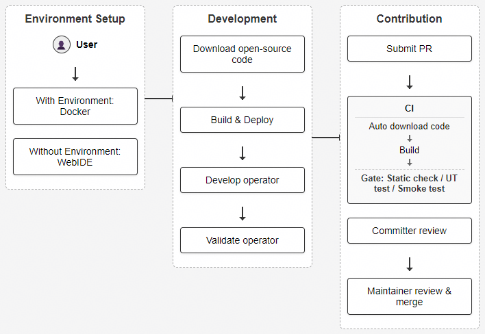

# Contribution Guide

This project welcomes developers to experience and participate in contributions. Before participating in community contributions, see [cann-community](https://gitcode.com/cann/community) to understand the code of conduct, sign the CLA agreement, and understand the contribution process of the source code repository.

Developers need to pay attention to the following points when preparing local code and submitting PRs:

1. When submitting a PR, fill in the business background, purpose, and solution of the PR carefully according to the PR template.
2. If your modification is not a simple bug fix but involves adding new features, new interfaces, new configuration parameters, or modifying code flow, submit an Issue for solution discussion first to avoid your code being rejected. If you are unsure whether your modification can be classified as a "simple bug fix," you can also submit an Issue for solution discussion.

Developer contribution scenarios mainly include:

## 1. Contributing New Operators

The operator development contribution process is as follows:



If you have a brand-new operator that you want to design and implement based on NPU, welcome to propose your idea and design solution in an Issue. The complete contribution process is as follows:

### 1. Create an Issue Requirement

Create a `Requirement|Requirement Suggestion` type Issue and describe the design solution for the new operator. The Issue generally needs to include the following content:

- **Background Information**
- **Value/Role**
- **Design Solution**

Comment `/assign @yourself` in the submitted Issue to claim the task.

### 2. Requirement Review

The Sig group will assign a Committer to review your submitted Issue and provide feedback. After completing the modifications, @ the corresponding Committer in the Issue.

If the requirement is accepted, [sig members](https://gitcode.com/cann/community/blob/master/CANN/sigs/ops-transformer/README.md) will assign an appropriate operator classification path for you (such as `experimental/attention`). Submit the contributed operator to the `experimental` corresponding operator classification directory.

### 3. PR Submission

The minimum operator deliverables for the ecosystem are as follows:

```text
${op_class}                                          # Operator classification
├── ${op_name}                                       # Operator name
│   ├── ${op_name}.cpp                               # Operator Kernel implementation file
│   └── tests
│   │   ├── test_${op_name}.py                       # Operator test file
│   ├── CMakeLists.txt                               # Operator compilation configuration file
│   ├── README.md                                    # Operator README document
```

PR submission requirements:

- Code deliverables: Provide the operator Kernel implementation and operator test file. For the development process, refer to [fast_kernel_launch_example](examples/fast_kernel_launch_example/README_en.md).
- Document deliverables: The operator README document is required, and other documents can be provided as needed. For document writing templates and specifications, refer to the [Document Contribution Guide](docs/CONTRIBUTING_DOCS_en.md).
- Compliance check:
  - Whether the code conforms to the [C++ Coding Standards](https://gitcode.com/cann/community/blob/master/contributor/coding-standards/C++%20Coding%20standards.md)
  - Whether the code compiles successfully
  - Whether the Markdown document syntax conforms to specifications
- Contribution directory: Submit to the specified directory `experimental/${op_class}` according to the sig member's opinion. Refer to the existing operator file placement rules.
- PR submission: Submit the target branch PR through `git` commands. Check whether the PR title is clear, whether the PR description is standard (specify the change content and reason, whether it is associated with the corresponding Issue), and whether the CLA is signed.

If you want to contribute project standard operators, the deliverables are more comprehensive than ecosystem operators, including Kernel, Tiling implementation, and so on. For contribution guidance, refer to [Appendix](#appendix).

### 4. CI Gate

Trigger the open-source repository gate by commenting the `compile` command, and make modifications based on the CI detection results. Currently, the CI gate includes the following check items:

- Code compilation
- Static check (if codecheck false positives are involved, submit them to sig members for shielding)
- UT testing
- Smoke testing

After the gate passes, @ the assigned Committer in the associated Issue.

### 5. Committer Review

The Committer will provide review feedback after the review. Modify according to the feedback, and then @ the assigned Committer after completion.

### 6. Maintainer Merge

After the Committer review passes, mark the `/lgtm` label. The Maintainer will conduct the final review within 1 day. After confirming no issues, mark the `/approve` label and merge the PR.

## 2. Operator Bug Fix

If you find certain operator bugs in this project and want to fix them, welcome to create a new Issue for feedback and tracking.

Follow the [Submit Issue/Process Issue Task](https://gitcode.com/cann/community#提交Issue处理Issue任务) guide to create a `Bug-Report|Bug Feedback` type Issue to describe the bug, then enter "/assign" or "/assign @yourself" in the comment box to assign the Issue to yourself for processing.

## 3. Operator Optimization

If you have ideas for generalization enhancement or performance optimization for certain operator implementations in this project and want to implement these optimization points, welcome to contribute operator optimizations.

Follow the [Submit Issue/Process Issue Task](https://gitcode.com/cann/community) guide to create a `Requirement|Requirement Suggestion` type Issue to describe the optimization points and provide your design solution, then enter "/assign" or "/assign @yourself" in the comment box to assign the Issue to yourself for tracking optimization.

## 4. Document Correction

If you find certain operator document description errors in this project, welcome to create a new Issue for feedback and correction. For document specifications, refer to the [Document Contribution Guide](docs/CONTRIBUTING_DOCS_en.md).

Follow the [Submit Issue/Process Issue Task](https://gitcode.com/cann/community) guide to create a `Documentation|Document Feedback` type Issue to point out the corresponding document problem, then enter "/assign" or "/assign @yourself" in the comment box to assign the Issue to yourself to correct the corresponding document description.

## 5. Help Resolve Others' Issues

If you have appropriate solutions for issues encountered by others in the community, welcome to comment and discuss in the Issue to help others solve problems and pain points, and jointly improve usability.

If the corresponding Issue requires code modification, enter "/assign" or "/assign @yourself" in the Issue comment box to assign the Issue to yourself for tracking and assisting in solving the problem.

## Appendix

The project standard operator deliverables are as follows:

```text
${op_class}                                          # Operator classification
├── ${op_name}                                       # Operator name
│   ├── op_host                                      # Operator definition, Tiling-related implementation
│   │   ├── ${op_name}_def.cpp                       # Operator definition file
│   │   ├── ${op_name}_tiling.cpp                    # Operator Tiling implementation file
│   │   └── CMakeLists.txt
│   ├── op_kernel                                    # Operator Kernel directory
│   │   ├── ${op_name}.cpp                           # Kernel entry file, including main function and scheduling logic
│   │   ├── ${op_name}.h                             # Kernel implementation file, defining Kernel header file, including function description, structure definition, logic implementation
│   │   ├── ${op_name}_tiling_data.h                 # TilingData file, storing Tiling strategy-related configuration information
│   │   └── ${op_name}_tiling_key.h                  # TilingKey file, defining the key of the Tiling strategy, identifying different partitioning methods
│   ├── CMakeLists.txt                               # Operator compilation configuration file, keep the original file
│   └── README.md                                    # Operator description document
│   └── tests                                        # Operator test file
│   │   ├── ut                                       # Operator UT test file
```

PR submission requirements:

- Code deliverables: Provide op_host operator Tiling implementation, op_kernel operator Kernel implementation, and operator UT test file. For the development process, refer to the [Operator Development Guide](docs/en/develop/aicore_develop_guide.md).
- Document deliverables: The operator README document is required, and other documents can be provided as needed. For document writing templates and specifications, refer to the [Document Contribution Guide](docs/CONTRIBUTING_DOCS_en.md).
- Compliance check:
  - Whether the code conforms to the [C++ Coding Standards](https://gitcode.com/cann/community/blob/master/contributor/coding-standards/C++%20Coding%20standards.md) and whether it conforms to the standard operator basic programming specifications
  - Whether the code compiles successfully
  - Whether the Markdown document syntax conforms to specifications
- Contribution directory: Submit to the specified directory `experimental/${op_class}` according to the sig member's opinion. Refer to the existing operator file placement rules.
- PR submission: Submit the target branch PR through `git` commands. Check whether the PR title is clear, whether the PR description is standard (specify the change content and reason, whether it is associated with the corresponding Issue), and whether the CLA is signed.
