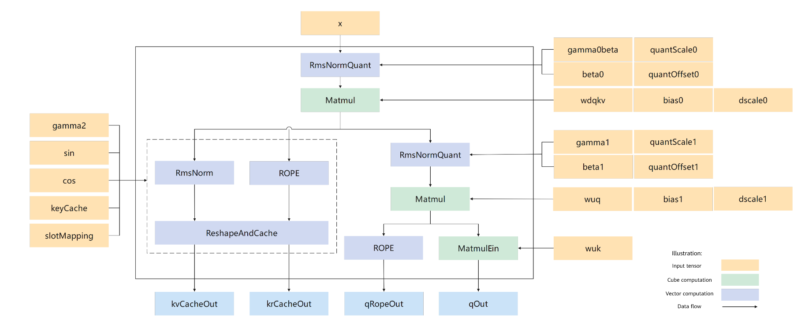

# aclnnMlaPreprocess

## Supported Products

|Product     | Supported|
|:----------------------------|:-----------:|
|<term>Atlas A3 training products/Atlas A3 inference products</term>|      √     |
|<term>Atlas A2 training products/Atlas A2 inference products</term>|      √     |
|<term>Atlas 200I/500 A2 inference products</term>|      ×     |
|<term>Atlas inference products</term>|      ×     |
|<term>Atlas training products</term>|      ×     |

## Function

- **Interface function**: In inference scenarios, this operator performs the preprocessing computation for Multi-Head Latent Attention. The computation process is as follows:
    - First, the input $x$ is processed by RmsNormQuant, then multiplied by $W^{DQKV}$ for downsampling, and finally split into path 1 and path 2.
    - Path 1 performs RmsNormQuant and then multiplies the result by $W^{UQ}$, and then splits the result into paths 3 and 4.
    - Path 3 is multiplied by $W^{uk}$ and then $q^N$ is output.
    - Path 4 is rotated and position-encoded, and then $q^R$ is output.
    - Path 2 is split into path 5 and path 6.
    - Path 5 is passed to the cache after RmsNorm to obtain $k^N$.
    - Path 6 undergoes rotary position encoding (ROPE) and then is stored into another cache to obtain $k^R$.

- **Computing flowchart**



- **Formula**:

    RmsNormQuant formula

    $$
    \text{RMS}(x) = \sqrt{\frac{1}{N} \sum_{i=1}^{N} x_i^2 + \epsilon}
    $$

    $$
    \text{RmsNorm}(x) = \gamma \cdot \frac{x_i}{\text{RMS}(x)}
    $$

    $$
    RmsNormQuant(x) = ({RmsNorm}(x) + bias) * deqScale
    $$
  
    Query calculation formula, including $W^{DQKV}$ matrix multiplication, $W^{UK}$ matrix multiplication, RmsNormQuant, and ROPE rotation position encoding.

    $$
    q^N =  RmsNormQuant(x) \cdot W^{DQKV} \cdot W^{UK}
    $$

    $$
    q^R = ROPE(x^Q)
    $$

    The computation formula of the key, including RmsNorm and ROPE. The computation result is stored in the cache.

    $$
    k^N = Cache({RmsNorm}(RmsNormQuant(x)))
    $$

    $$
    k^R = Cache(ROPE(RmsNormQuant(x)))
    $$

## Prototype

Each operator has [two-phase API](../../../docs/en/context/two_phase_api.md) calls. First, `aclnnMlaPreprocessGetWorkspaceSize` is called to obtain the input parameters and compute the required workspace size based on the process. Then, `aclnnMlaPreprocess` is called to perform computation.

```cpp
aclnnStatus aclnnMlaPreprocessGetWorkspaceSize(
  const aclTensor *input, 
  const aclTensor *gamma0, 
  const aclTensor *beta0, 
  const aclTensor *quantScale0, 
  const aclTensor *quantOffset0,
  const aclTensor *wdqkv, 
  const aclTensor *deScale0, 
  const aclTensor *bias0, 
  const aclTensor *gamma1, 
  const aclTensor *beta1, 
  const aclTensor *quantScale1, 
  const aclTensor *quantOffset1, 
  const aclTensor *wuq, 
  const aclTensor *deScale1, 
  const aclTensor *bias1, 
  const aclTensor *gamma2, 
  const aclTensor *cos, 
  const aclTensor *sin, 
  const aclTensor *wuk, 
  const aclTensor *kvCache, 
  const aclTensor *kvCacheRope, 
  const aclTensor *slotMapping, 
  const aclTensor *ctkvScale, 
  const aclTensor *qNopeScale, 
  int64_t          wdqDim, 
  int64_t          qRopeDim, 
  int64_t          kRopeDim, 
  double           epsilon, 
  int64_t          qRotaryCoeff, 
  int64_t          kRotaryCoeff, 
  bool             transposeWdq, 
  bool             transposeWuq, 
  bool             transposeWuk, 
  int64_t          cacheMode, 
  int64_t          quantMode, 
  bool             doRmsNorm, 
  int64_t          wdkvSplitCount, 
  aclTensor       *qOut, 
  aclTensor       *kvCacheOut, 
  aclTensor       *qRopeOut, 
  aclTensor       *krCacheOut, 
  uint64_t        *workspaceSize, 
  aclOpExecutor   **executor)
```

```cpp
aclnnStatus aclnnMlaPreprocess(
  void          *workspace, 
  uint64_t       workspaceSize, 
  aclOpExecutor *executor, 
  aclrtStream    stream)
```

## aclnnMlaPreprocessGetWorkspaceSize

- **Parameters**
  <table style="undefined;table-layout: fixed; width: 1550px"><colgroup>
  <col style="width: 151px">
  <col style="width: 121px">
  <col style="width: 301px">
  <col style="width: 331px">
  <col style="width: 237px">
  <col style="width: 111px">
  <col style="width: 170px">
  <col style="width: 100px">
  </colgroup>
  <thead>
    <tr>
      <th>Name</th>
      <th>Input/Output</th>
      <th>Description</th>
      <th>Usage Notes</th>
      <th>Data Type</th>
      <th>Data Format</th>
      <th>Dimension (Shape)</th>
      <th>Non-contiguous Tensor</th>
    </tr></thead>
  <tbody>
    <tr>
      <td>input</td>
      <td>Input</td>
      <td>x used to calculate the query and key.</td>
      <td>-</td>
      <td>FLOAT16, BFLOAT16</td>
      <td>ND</td>
      <td>[tokenNum,hiddenSize]</td>
      <td>-</td>
    </tr>
    <tr>
      <td>gamma0</td>
      <td>Input</td>
      <td>The γ parameter in the first RmsNorm calculation.</td>
      <td>Its data type and the data type of input must meet the type deduction rules (see <a href="../../../docs/en/context/deduction_relationship.md">deduction relationship</a> and <a href="#Constraints">Constraints</a>).</td>
      <td>FLOAT16, BFLOAT16</td>
      <td>ND</td>
      <td>[hiddenSize]</td>
      <td>-</td>
    </tr>
    <tr>
      <td>beta0</td>
      <td>Input</td>
      <td>The β parameter in the first RmsNorm calculation.</td>
      <td>Its data type and the data type of input must meet the type deduction rules (see <a href="../../../docs/en/context/deduction_relationship.md">deduction relationship</a> and <a href="#Constraints">Constraints</a>).</td>
      <td>FLOAT16, BFLOAT16</td>
      <td>ND</td>
      <td>[hiddenSize]</td>
      <td>-</td>
    </tr>
    <tr>
      <td>quantScale0</td>
      <td>Input</td>
      <td>Quantization scaling parameter in the first RMSNorm formula.</td>
      <td>Its data type and the data type of input must meet the type deduction rules (see <a href="../../../docs/en/context/deduction_relationship.md">deduction relationship</a> and <a href="#Constraints">Constraints</a>).</td>
      <td>FLOAT16, BFLOAT16</td>
      <td>ND</td>
      <td>[1]</td>
      <td>-</td>
    </tr>
    <tr>
      <td>quantOffset0</td>
      <td>Input</td>
      <td>Quantization offset parameter in the first RMSNorm formula.</td>
      <td>Its data type and the data type of input must meet the type deduction rules (see <a href="../../../docs/en/context/deduction_relationship.md">deduction relationship</a> and <a href="#Constraints">Constraints</a>).</td>
      <td>INT8</td>
      <td>ND</td>
      <td>[1]</td>
      <td>-</td>
    </tr>
    <tr>
      <td>wdqkv</td>
      <td>Input</td>
      <td>Down-projection matrix used in the first matrix multiplication with the input.</td>
      <td>-</td>
      <td>INT8, FLOAT16, BFLOAT16</td>
      <td>NZ</td>
      <td>[2112,hiddenSize]</td>
      <td>-</td>
    </tr>
    <tr>
      <td>deScale0</td>
      <td>Input</td>
      <td>Coefficient of the down-projection matrix used in the first matrix multiplication.</td>
      <td>When input dtype is FLOAT16, INT64 is supported; when input dtype is BFLOAT16, FLOAT is supported.</td>
      <td>INT32, FLOAT</td>
      <td>ND</td>
      <td>[2112]</td>
      <td>-</td>
    </tr>
    <tr>
      <td>bias0</td>
      <td>Input</td>
      <td>Coefficient of the down-projection matrix used in the first matrix multiplication.</td>
      <td>An empty tensor can be passed. This parameter is not passed when quantMode is set to 1 or 3.</td>
      <td>INT32</td>
      <td>ND</td>
      <td>[2112]</td>
      <td>-</td>
    </tr>
    <tr>
      <td>gamma1</td>
      <td>Input</td>
      <td>The γ parameter in the second RmsNorm calculation.</td>
      <td>Its data type and the data type of input must meet the type deduction rules (see <a href="../../../docs/en/context/deduction_relationship.md">deduction relationship</a> and <a href="#Constraints">Constraints</a>).</td>
      <td>FLOAT16, BFLOAT16</td>
      <td>ND</td>
      <td>[1536]</td>
      <td>-</td>
    </tr>
    <tr>
      <td>beta1</td>
      <td>Input</td>
      <td>The β parameter in the second RmsNorm calculation.</td>
      <td>The data type must comply with the data type deduction rules of the input. For details, see <a href="../../../docs/en/context/deduction_relationship.md"> deduction relationship </a> and <a href="##Restrictions "> Restrictions </a>.</td>
      <td>FLOAT16, BFLOAT16</td>
      <td>ND</td>
      <td>[1536]</td>
      <td>-</td>
    </tr>
    <tr>
      <td>quantScale1</td>
      <td>Input</td>
      <td>Quantization scaling parameter in the second RMSNorm formula.</td>
      <td>Its data type and the data type of input must meet the type deduction rules (see <a href="../../../docs/en/context/deduction_relationship.md">deduction relationship</a> and <a href="#Constraints">Constraints</a>).</td>
      <td>FLOAT16, BFLOAT16</td>
      <td>ND</td>
      <td>[1]</td>
      <td>-</td>
    </tr>
    <tr>
      <td>quantOffset1</td>
      <td>Input</td>
      <td>Quantization offset parameter in the second RMSNorm formula.</td>
      <td>Its data type and the data type of input must meet the type deduction rules (see <a href="../../../docs/en/context/deduction_relationship.md">deduction relationship</a> and <a href="#Constraints">Constraints</a>).</td>
      <td>INT8</td>
      <td>ND</td>
      <td>[1]</td>
      <td>-</td>
    </tr>
    <tr>
      <td>wuq</td>
      <td>Input</td>
      <td>Weight matrix.</td>
      <td>-</td>
      <td>INT8, FLOAT16, BFLOAT16</td>
      <td>NZ</td>
      <td>[headNum * 192,1536]</td>
      <td>-</td>
    </tr>
    <tr>
      <td>deScale1</td>
      <td>Input</td>
      <td>Coefficient involved in the WuQ matrix multiplication.</td>
      <td>If the input dtype is FLOAT16, the input supports INT64. If the input dtype is BFLOAT16, the input supports FLOAT.</td>
      <td>INT64, FLOAT</td>
      <td>ND</td>
      <td>[headNum*192]</td>
      <td>-</td>
    </tr>
    <tr>
      <td>bias1</td>
      <td>Input</td>
      <td>Coefficient involved in the WuQ matrix multiplication.</td>
      <td>This parameter is not passed when quantMode is set to 1 or 3.</td>
      <td>INT32</td>
      <td>ND</td>
      <td>[headNum*192]</td>
      <td>-</td>
    </tr>
    <tr>
      <td>gamma2</td>
      <td>Input</td>
      <td>The γ parameter involved in RmsNormAndreshapeAndCache calculation.</td>
      <td>Its data type and the data type of input must meet the type deduction rules (see <a href="../../../docs/en/context/deduction_relationship.md">deduction relationship</a> and <a href="#Constraints">Constraints</a>).</td>
      <td>FLOAT16, BFLOAT16</td>
      <td>ND</td>
      <td>[512]</td>
      <td>-</td>
    </tr>
    <tr>
      <td>cos</td>
      <td>Input</td>
      <td>The sine parameter matrix used for computing rotary position encoding (ROPE).</td>
      <td>-</td>
      <td>FLOAT16, BFLOAT16</td>
      <td>ND</td>
      <td>[tokenNum,64]</td>
      <td>-</td>
    </tr>
    <tr>
      <td>sin</td>
      <td>Input</td>
      <td>The cosine parameter matrix used for computing rotary position encoding (ROPE).</td>
      <td>-</td>
      <td>FLOAT16, BFLOAT16</td>
      <td>ND</td>
      <td>[tokenNum,64]</td>
      <td>-</td>
    </tr>
    <tr>
      <td>wuk</td>
      <td>Input</td>
      <td>Upsampling weight of the key for computation.</td>
      <td><ul>
      <li>For the ND format, the shape is [headNum, 128, 512].</li>
      <li>For the NZ format, the shape is [headNum, 32, 128, 16].</li></ul>
      </td>
      <td>FLOAT16, BFLOAT16</td>
      <td>ND and NZ</td>
      <td>[headNum * 192, 1536]</td>
      <td>-</td>
    </tr>
    <tr>
      <td>kvCache</td>
      <td>Input</td>
      <td>The same tensor as the output kvCacheOut.</td>
      <td>The input format varies with cacheMode: <ul>
        <li>When cacheMode is 0, the shape is [blockNum,blockSize,1,576], the dtype is the same as that of the input, and the <a href="../../../docs/en/context/data_format.md"> Data Format</a> is ND.</li>
        <li>When cacheMode is 1, the shape is [blockNum,blockSize,1,512], the tensor shape is split, the dtype is the same as that of the input, and the <a href="../../../docs/en/context/data_format.md"> Data Format</a> is ND.</li>
        <li>When cacheMode is 2, the shape is [blockNum,16,blockSize,32], the dtype is int8, and the <a href="../../../docs/en/context/data_format.md"> Data Format</a> is NZ.</li>
        <li>When cacheMode is 3, the shape is [blockNum,32,blockSize,16], the dtype is the same as that of the input, and the <a href="../../../docs/en/context/data_format.md"> Data Format</a> is NZ.</li></ul>
      </td>
      <td>INT8, FLOAT16, BFLOAT16</td>
      <td>ND and NZ</td>
      <td>-</td>
      <td>-</td>
    </tr>
    <tr>
      <td>kvCacheRope</td>
      <td>Input</td>
      <td>The same tensor as the output krCacheOut.</td>
      <td>Optional. A null pointer can be passed. The input format varies with cacheMode. <ul>
        <li>When cacheMode is 0, no input is passed.</li>
        <li>When cacheMode is 1, the shape is [blockNum,blockSize,1,64], the dtype is the same as that of the input, and the <a href="../../../docs/en/context/data_format.md"> Data Format</a> is ND.</li>
        <li>When cacheMode is 2 or 3, the shape is [blockNum, 4, blockSize, 16], the dtype is the same as that of the input, and the <a href="../../../docs/en/context/data_format.md"> Data Format</a> is NZ.</li></ul>
      </td>
      <td>FLOAT16, BFLOAT16</td>
      <td>ND and NZ</td>
      <td>-</td>
      <td>-</td>
    </tr>
    <tr>
      <td>slotMapping</td>
      <td>Input</td>
      <td>Index used to store kv_cache and kr_cache.</td>
      <td>-</td>
      <td>INT32</td>
      <td>ND</td>
      <td>[tokenNum]</td>
      <td>-</td>
    </tr>
    <tr>
      <td>ctkvScale</td>
      <td>Input</td>
      <td>Coefficients involved in the computation during output quantization</td>
      <td>This parameter is passed only when cacheMode is set to 2.</td>
      <td>BLOAT16, BFLOAT16</td>
      <td>ND</td>
      <td>[1]</td>
      <td>-</td>
    </tr>
    <tr>
      <td>qNopeScale</td>
      <td>Input</td>
      <td>Coefficients involved in the computation during output quantization.</td>
      <td>This parameter is passed only when cacheMode is set to 2.</td>
      <td>BLOAT16, BFLOAT16</td>
      <td>ND</td>
      <td>[1]</td>
      <td>-</td>
    </tr>
    <tr>
      <td>wdqDim</td>
      <td>Input</td>
      <td>Split dimension size after matmul.</td>
      <td>Reserved parameter. Currently, only 1536 is supported.</td>
      <td>int64_t</td>
      <td>-</td>
      <td>-</td>
      <td>-</td>
    </tr>
    <tr>
      <td>qRopeDim</td>
      <td>Input</td>
      <td>Dimension size of q passed to RoPE.</td>
      <td>Reserved parameter. Currently, only 64 is supported.</td>
      <td>int64_t</td>
      <td>-</td>
      <td>-</td>
      <td>-</td>
    </tr>
    <tr>
      <td>kRopeDim</td>
      <td>Input</td>
      <td>Dimension size of k passed to RoPE.</td>
      <td>Reserved parameter. Currently, only 64 is supported.</td>
      <td>int64_t</td>
      <td>-</td>
      <td>-</td>
      <td>-</td>
    </tr>
    <tr>
      <td>epsilon</td>
      <td>Input</td>
      <td>It is added to the denominator to prevent division by 0.</td>
      <td>-</td>
      <td>double</td>
      <td>-</td>
      <td>-</td>
      <td>-</td>
    </tr>
    <tr>
      <td>qRotaryCoeff</td>
      <td>Input</td>
      <td>q rotation coefficient.</td>
      <td>Reserved parameter. Currently, only 2 is supported.</td>
      <td>int64_t</td>
      <td>-</td>
      <td>-</td>
      <td>-</td>
    </tr>
    <tr>
      <td>kRotaryCoeff</td>
      <td>Input</td>
      <td>k rotation coefficient.</td>
      <td>Reserved parameter. Currently, only 2 is supported.</td>
      <td>int64_t</td>
      <td>-</td>
      <td>-</td>
      <td>-</td>
    </tr>
    <tr>
      <td>transposeWdq</td>
      <td>Input</td>
      <td>Whether to transpose wdq.</td>
      <td>Reserved parameter. Currently, only true is supported.</td>
      <td>bool</td>
      <td>-</td>
      <td>-</td>
      <td>-</td>
    </tr>
    <tr>
      <td>transposeWuq</td>
      <td>Input</td>
      <td>Whether to transpose wuq.</td>
      <td>Reserved parameter. Currently, only true is supported.</td>
      <td>bool</td>
      <td>-</td>
      <td>-</td>
      <td>-</td>
    </tr>
    <tr>
      <td>transposeWuk</td>
      <td>Input</td>
      <td>Whether to transpose wuk.</td>
      <td>Reserved parameter. Currently, only true is supported.</td>
      <td>bool</td>
      <td>-</td>
      <td>-</td>
      <td>-</td>
    </tr>
    <tr>
      <td>cacheMode</td>
      <td>Input</td>
      <td>Specified cache type.</td>
      <td><ul>
        <li>0: kcache and q are concatenated and then output.</li>
        <li>1: The output kvCacheOut is split into kvCacheOut and krCacheOut, and qOut is split into qOut and qRopeOut.</li>
        <li>2: krope and ctkv are converted into the NZ format for output, and ctkv and qnope are quantized into the int8 type through per_head static symmetric quantization.</li>
        <li>3: krope and ctkv are converted into the NZ format for output.</li></ul>
      </td>
      <td>int64_t</td>
      <td>-</td>
      <td>-</td>
      <td>-</td>
    </tr>
    <tr>
      <td>quantMode</td>
      <td>Input</td>
      <td>RMSNorm quantization type.</td>
      <td><ul>
        <li>0: per_tensor static asymmetric quantization, which is the default quantization type.</li>
        <li>1: per_token dynamic symmetric quantization, which is not implemented.</li>
        <li>2: per_token dynamic asymmetric quantization, which is not implemented.</li>
        <li>3: No quantization, floating-point output, which is not implemented.</li></ul>
      </td>
      <td>int64_t</td>
      <td>-</td>
      <td>-</td>
      <td>-</td>
    </tr>
    <tr>
      <td>doRmsNorm</td>
      <td>Input</td>
      <td>Whether to perform RmsNormQuant or Quant on the input tensor.</td>
      <td><ul>
        <li>false: Only Quant is performed on the input tensor, and RmsNorm</li> is not performed.
        <li>true: RmsNormQuant is performed on the input tensor.</li></ul>
      </td>
      <td>bool</td>
      <td>-</td>
      <td>-</td>
      <td>-</td>
    </tr>
    <tr>
      <td>wdkvSplitCount</td>
      <td>Input</td>
      <td>Number of WDKV splits.</td>
      <td>The value range is [1, 3], indicating that the matrix is not split, split into two matrices, or split into three matrices, respectively. Reserved parameter. Currently, only 1 is supported.</td>
      <td>int64_t</td>
      <td>-</td>
      <td>-</td>
      <td>-</td>
    </tr>
    <tr>
      <td>qOut</td>
      <td>Output</td>
      <td>Indicates the output tensor of the query, which corresponds to the output after NOPE and matrix multiplication on the right of the computation flow graph.</td>
      <td>The shape and dtype vary with cacheMode.
        <ul><li>When cacheMode is 0, the shape is [tokenNum, headNum, 576], the dtype is the same as that of the input, and the <a href="../../../docs/en/context/data_format.md"> Data Format</a> is ND.</li>
        <li>When cacheMode is 1 or 3, the shape is [tokenNum, headNum, 512], the dtype is the same as that of the input, and the <a href="../../../docs/en/context/data_format.md"> Data Format</a> is ND.</li>
        <li>When cacheMode is 2, the shape is [tokenNum, headNum, 512], the dtype is INT8, and the <a href="../../../docs/en/context/data_format.md"> Data Format</a> is ND.</li></ul>
      </td>
      <td>INT8, FLOAT16, BFLOAT16</td>
      <td>ND</td>
      <td>-</td>
      <td>-</td>
    </tr>
    <tr>
      <td>kvCacheOut</td>
      <td>Output</td>
      <td>Output of the key after ReshapeAndCache.</td>
      <td>The shape and dtype vary with cacheMode.
        <ul><li>When cacheMode is 0, the shape is [blockNum,blockSize,1,576], the dtype is the same as that of the input, and the <a href="../../../docs/en/context/data_format.md"> Data Format</a> is ND.</li>
        <li>When cacheMode is 1, the shape is [blockNum,blockSize,1,512], the dtype is the same as that of the input, and the <a href="../../../docs/en/context/data_format.md"> Data Format</a> is ND.</li>
        <li>When cacheMode is 2, the shape is [blockNum, 16, blockSize, 32], the dtype is INT8, and the <a href="../../../docs/en/context/data_format.md"> Data Format</a> is NZ.</li>
        <li>When cacheMode is 3, the shape is [blockNum, 32, blockSize, 16], the dtype is the same as that of the input, and the <a href="../../../docs/en/context/data_format.md"> Data Format</a> is NZ.</li></ul>
      </td>
      <td>INT8, FLOAT16, BFLOAT16</td>
      <td>ND and NZ</td>
      <td>-</td>
      <td>-</td>
    </tr>
    <tr>
      <td>qRopeOut</td>
      <td>Output</td>
      <td>Output of the query after rotation programming.</td>
      <td>The shape and dtype vary with cacheMode:
        <ul><li>When cacheMode is 0, no output is generated.</li>
        <li>When cacheMode is 1 or 3, the shape is [tokenNum, headNum, 64], the dtype is the same as that of the input, and the <a href="../../../docs/en/context/data_format.md"> Data Format</a> is ND.</li>
        <li>When cacheMode is 2, the shape is [tokenNum, headNum, 64], the dtype is the same as that of the input, and the <a href="../../../docs/en/context/data_format.md"> Data Format</a> is ND.</li></ul>
      </td>
      <td>FLOAT16, BFLOAT16</td>
      <td>ND</td>
      <td>-</td>
      <td>-</td>
    </tr>
    <tr>
      <td>krCacheOut</td>
      <td>Output</td>
      <td>Output of the key after ROPE and ReshapeAndCache.</td>
      <td>The shape and dtype vary with cacheMode. 
        <ul><li>When cacheMode is set to 0, no output is generated.</li>
        <li>When cacheMode is 1, the shape is [blockNum, blockSize, 1, 64], the dtype is the same as that of the input, and the <a href="../../../docs/en/context/data_format.md"> Data Format</a> is ND.</li>
        <li>When cacheMode is 2 or 3, the shape is [blockNum, 4, blockSize, 16], the dtype is the same as that of the input, and the <a href="../../../docs/en/context/data_format.md"> Data Format</a> is NZ.</li></ul>
      </td>
      <td>FLOAT16, BFLOAT16</td>
      <td>ND and NZ</td>
      <td>-</td>
      <td>-</td>
    </tr>
    <tr>
      <td>workspaceSize</td>
      <td>Output</td>
      <td>Size of the workspace required to be allocated on the device.</td>
      <td>-</td>
      <td>-</td>
      <td>-</td>
      <td>-</td>
      <td>-</td>
    </tr>
    <tr>
      <td>executor</td>
      <td>Output</td>
      <td>Operator executor, containing the operator computation process.</td>
      <td>-</td>
      <td>-</td>
      <td>-</td>
      <td>-</td>
      <td>-</td>
    </tr>
  </tbody></table>

- **Returns**

  `aclnnStatus`: status code. For details, see [aclnn Return Code](../../../docs/en/context/aclnn_return_code.md).

  The first-phase API implements input parameter verification. The following errors may be thrown.
  <table style="undefined;table-layout: fixed; width: 1155px"><colgroup>
  <col style="width: 275px">
  <col style="width: 125px">
  <col style="width: 755px">
  </colgroup>
  <thead>
    <tr>
      <th>Return</th>
      <th>Error Code</th>
      <th>Description</th>
    </tr></thead>
  <tbody>
    <tr>
      <td>ACLNN_ERR_PARAM_NULLPTR</td>
      <td>161001</td>
      <td>A mandatory input parameter contains a null pointer.</td>
    </tr>
    <tr>
      <td>ACLNN_ERR_PARAM_INVALID</td>
      <td>161002</td>
      <td>The shape, dtype, or data type of the input parameter is not supported.</td>
    </tr>
    <tr>
      <td>ACLNN_ERR_RUNTIME_ERROR</td>
      <td>361001</td>
      <td>An exception occurred when the NPU Runtime API was called.</td>
    </tr>
    <tr>
      <td>ACLNN_ERR_INNER_TILING_ERROR</td>
      <td>561002</td>
      <td>An exception occurs during tiling. The dtype or shape of the input parameter is incorrect.</td>
    </tr>
  </tbody>
  </table>

## aclnnMlaPreprocess

- **Parameters**
  <table style="undefined;table-layout: fixed; width: 1155px"><colgroup>
  <col style="width: 173px">
  <col style="width: 133px">
  <col style="width: 849px">
  </colgroup>
  <thead>
    <tr>
      <th>Name</th>
      <th>Input/Output</th>
      <th>Description</th>
    </tr></thead>
  <tbody>
    <tr>
      <td>workspace</td>
      <td>Input</td>
      <td>Address of the workspace to be allocated on the device.</td>
    </tr>
    <tr>
      <td>workspaceSize</td>
      <td>Input</td>
      <td>Size of the workspace to be allocated on the device, obtained by calling the first-phase API aclnnBatchMatMulGetWorkspaceSize.</td>
    </tr>
    <tr>
      <td>executor</td>
      <td>Input</td>
      <td>Operator executor, containing the operator computation process.</td>
    </tr>
    <tr>
      <td>stream</td>
      <td>Input</td>
      <td>Stream for executing the task.</td>
    </tr>
  </tbody>
  </table>

- **Returns**

  `aclnnStatus`: status code. For details, see [aclnn Return Code](../../../docs/en/context/aclnn_return_code.md).

## Constraints

- Deterministic computation:
  - The `aclnnMlaPreprocess` is implemented in deterministic mode by default.
- Meanings and restrictions of the shape format fields
    - `tokenNum`: batch size of input samples. The value ranges from 0 to 256.
    - `hiddenSize`: size of the hidden layer. The value ranges from 2048 to 10240 and must be a multiple of 256.
    - `headNum`: number of heads. Value range: 16, 32, 64, 128.
    - `blockNum`: number of blocks in the `PagedAttention` scenario. The value range is 192.
    - `blockSize`: block size in the `PagedAttention` scenario. The value range is 128.
    - When the data type of `wdqkv` and `wuq` is bfloat16, the input must also be bfloat16. In addition, `hiddenSize` can only be 6144, and `cacheMode` can only be 0 or 1.

## Example

The following example is for reference only. For details, see [Compile and Run Sample](../../../docs/en/context/compile_and_run_sample.md).

```Cpp
/**
 * This program is free software, you can redistribute it and/or modify.
 * Copyright (c) 2025 Huawei Technologies Co., Ltd.|Hisilicon Technologies Co., Ltd.
 * This file is a part of the CANN Open Software.
 * Licensed under CANN Open Software License Agreement Version 2.0 (the "License").
 * Please refer to the License for details. You may not use this file except in compliance with the License.
 * THIS SOFTWARE IS PROVIDED ON AN "AS IS" BASIS, WITHOUT WARRANTIES OF ANY KIND, EITHER EXPRESS OR IMPLIED, INCLUDING BUT NOT LIMITED TO NON-INFRINGEMENT, MERCHANTABILITY, OR FITNESS FOR A PARTICULAR PURPOSE.
 * See LICENSE in the root of the software repository for the full text of the License.
 */

/*!
 * \file test_aclnn_mla_preprocess.cpp
 * \brief
 */

#include <iostream>
#include <vector>
#include <sys/stat.h>
#include <fstream>
#include <fcntl.h>
#include <unistd.h>
#include <cstdio>
#include <cassert>
#include <iomanip>
#include <unistd.h>
#include "acl/acl.h"
#include "aclnn/acl_meta.h"
#include "aclnnop/aclnn_mla_preprocess.h"

#define CHECK_RET(cond, return_expr)                                           \
  do {                                                                         \
    if (!(cond)) {                                                             \
      return_expr;                                                             \
    }                                                                          \
  } while (0)

#define LOG_PRINT(message, ...)                                                \
  do {                                                                         \
    printf(message, ##__VA_ARGS__);                                            \
  } while (0)

template <typename T>
bool ReadFile(const std::string &filePath, std::vector<int64_t> shape, std::vector<T>& hostData)
{
    size_t fileSize = 1;
    for (int64_t i : shape){
        fileSize *= i; 
    }
    std::ifstream file(filePath, std::ios::binary);
    if (!file.is_open()) {
        std::cerr << "Failed to open the file." << std::endl;
        return 1;
    }
    // Obtain the file size.
    file.seekg(0, std::ios::end);
    file.seekg(0, std::ios::beg);
    hostData.reserve(fileSize);
    if (file.read(reinterpret_cast<char*>(hostData.data()), fileSize * sizeof(T))) {
    } else {
        std::cerr << "Failed to read the file." << std::endl;
        return 1;
    }
    file.close();
    return true;
}

template <typename T>
bool WriteFile(const std::string &filePath, int64_t size, std::vector<T>& hostData)
{
    int fd = open(filePath.c_str(), O_RDWR | O_CREAT | O_TRUNC, S_IRUSR | S_IWRITE);
    if (fd < 0) {
        LOG_PRINT("Open file failed. path = %s", filePath.c_str());
        return false;
    }

    size_t writeSize = write(fd, reinterpret_cast<char*>(hostData.data()), size * sizeof(T));
    (void)close(fd);
    if (writeSize != size * sizeof(T)) {
        LOG_PRINT("Write file Failed.");
        return false;
    }

    return true;
}

int64_t GetShapeSize(const std::vector<int64_t>& shape)
{
    int64_t shapeSize = 1;
    for (auto i : shape) {
        shapeSize *= i;
    }
    return shapeSize;
}

void PrintOutResult(std::vector<int64_t>& shape, void** deviceAddr, int num)
{
    auto size = GetShapeSize(shape);
    std::vector<float> resultData(size, 0);
    auto ret = aclrtMemcpy(resultData.data(), resultData.size() * sizeof(resultData[0]), *deviceAddr,
                          size * sizeof(resultData[0]), ACL_MEMCPY_DEVICE_TO_HOST);
    CHECK_RET(ret == ACL_SUCCESS, LOG_PRINT("copy result from device to host failed. ERROR: %d\n", ret); return);
    for (int64_t i = 0; i < 10; i++) {
        LOG_PRINT("result[%ld] is: %f\n", i, resultData[i]);
    }
}

int Init(int32_t deviceId, aclrtStream *stream) {
  // (Fixed writing) Initialize resources.
  auto ret = aclInit(nullptr);
  CHECK_RET(ret == ACL_SUCCESS, LOG_PRINT("aclInit failed. ERROR: %d\n", ret);
            return ret);
  ret = aclrtSetDevice(deviceId);
  CHECK_RET(ret == ACL_SUCCESS,
            LOG_PRINT("aclrtSetDevice failed. ERROR: %d\n", ret);
            return ret);
  ret = aclrtCreateStream(stream);
  CHECK_RET(ret == ACL_SUCCESS,
            LOG_PRINT("aclrtCreateStream failed. ERROR: %d\n", ret);
            return ret);
  return 0;
}

template <typename T>
int CreateAclTensor(const std::vector<T> &hostData,
                    const std::vector<int64_t> &shape, void **deviceAddr,
                    aclDataType dataType, aclTensor **tensor) {
  auto size = GetShapeSize(shape) * sizeof(T);
  // Call aclrtMalloc to allocate memory on the device.
  auto ret = aclrtMalloc(deviceAddr, size, ACL_MEM_MALLOC_HUGE_FIRST);
  CHECK_RET(ret == ACL_SUCCESS,
            LOG_PRINT("aclrtMalloc failed. ERROR: %d\n", ret);
            return ret);
  // Call aclrtMemcpy to copy host data to the device memory.
  ret = aclrtMemcpy(*deviceAddr, size, hostData.data(), size,
                    ACL_MEMCPY_HOST_TO_DEVICE);
  CHECK_RET(ret == ACL_SUCCESS,
            LOG_PRINT("aclrtMemcpy failed. ERROR: %d\n", ret);
            return ret);

  // Compute the strides of the contiguous tensor.
  std::vector<int64_t> strides(shape.size(), 1);
  for (int64_t i = shape.size() - 2; i >= 0; i--) {
    strides[i] = shape[i + 1] * strides[i + 1];
  }

  // Call aclCreateTensor to create an aclTensor.
  *tensor = aclCreateTensor(shape.data(), shape.size(), dataType,
                            strides.data(), 0, aclFormat::ACL_FORMAT_ND,
                            shape.data(), shape.size(), *deviceAddr);
  return 0;
}


template <typename T>
int CreateAclTensorND(const std::vector<T>& shape, void** deviceAddr, void** hostAddr,
                    aclDataType dataType, aclTensor** tensor) {
    auto size = GetShapeSize(shape) * sizeof(T);
    // Call aclrtMalloc to allocate memory on the device.
    auto ret = aclrtMalloc(deviceAddr, size,  ACL_MEM_MALLOC_HUGE_FIRST);
    CHECK_RET(ret == ACL_SUCCESS, LOG_PRINT("aclrtMalloc ND tensor device failed. ERROR: %d\n", ret); return ret);
    // Call aclrtMalloc to allocate memory on the host.
    ret = aclrtMalloc(hostAddr, size,   ACL_MEM_MALLOC_HUGE_FIRST);
    CHECK_RET(ret == ACL_SUCCESS, LOG_PRINT("aclrtMalloc ND tensor host failed. ERROR: %d\n", ret); return ret);
    // Call aclCreateTensor to create an aclTensor.
    *tensor = aclCreateTensor(shape.data(), shape.size(), dataType, nullptr, 0, aclFormat::ACL_FORMAT_ND,
                              shape.data(), shape.size(), *deviceAddr);
    // Call aclrtMemcpy to copy host data to the device memory.
    ret = aclrtMemcpy(*deviceAddr, size, *hostAddr,   GetShapeSize(shape)*aclDataTypeSize(dataType),  ACL_MEMCPY_HOST_TO_DEVICE);
    CHECK_RET(ret == ACL_SUCCESS, LOG_PRINT("aclrtMemcpy  failed. ERROR: %d\n", ret); return ret);
    return 0;
}

template <typename T>
int CreateAclTensorNZ(const std::vector<T>& shape,  void** deviceAddr, void** hostAddr,
                    aclDataType dataType, aclTensor**   tensor) {
    auto size = GetShapeSize(shape) * sizeof(T);
    // Call aclrtMalloc to allocate memory on the device.
    auto ret = aclrtMalloc(deviceAddr, size,  ACL_MEM_MALLOC_HUGE_FIRST);
    CHECK_RET(ret == ACL_SUCCESS, LOG_PRINT("aclrtMalloc NZ tensor device failed. ERROR: %d\n", ret); return ret);
    // Call aclrtMalloc to allocate memory on the host.
    ret = aclrtMalloc(hostAddr, size,   ACL_MEM_MALLOC_HUGE_FIRST);
    CHECK_RET(ret == ACL_SUCCESS, LOG_PRINT("aclrtMalloc NZ tensor device failed. ERROR: %d\n", ret); return ret);
    // Call aclCreateTensor to create an aclTensor.
    *tensor = aclCreateTensor(shape.data(), shape.size  (), dataType, nullptr, 0,   aclFormat::ACL_FORMAT_FRACTAL_NZ,
                              shape.data(), shape.size  (), *deviceAddr);
    // Call aclrtMemcpy to copy host data to the device memory.
    ret = aclrtMemcpy(*deviceAddr, size, *hostAddr,   GetShapeSize(shape)*aclDataTypeSize(dataType),  ACL_MEMCPY_HOST_TO_DEVICE);
    CHECK_RET(ret == ACL_SUCCESS, LOG_PRINT("aclrtMemcpy  failed. ERROR: %d\n", ret); return ret);
    return 0;
}

int TransToNZShape(std::vector<int64_t> &shapeND, size_t  typeSize) {
    int64_t h = shapeND[0];
    int64_t w = shapeND[1];
    int64_t h0 = 16;
    int64_t w0 = 32U / typeSize;
    int64_t h1 = h / h0;
    int64_t w1 = w / w0;
    shapeND[0] = w1;
    shapeND[1] = h1;
    shapeND.emplace_back(h0);
    shapeND.emplace_back(w0);
    return 0;
}

int main() {
  // 1. (Fixed writing) Initialize the device and stream. For details, see the AscendCL API manual.
  // Set the device ID in use.
  int32_t deviceId = 5;
  aclrtStream stream;
  auto ret = Init(deviceId, &stream);
  CHECK_RET(ret == ACL_SUCCESS, LOG_PRINT("Init acl failed. ERROR: %d\n", ret);
            return ret);
  // Attributes.
  int64_t tokenNum = 8;
  int64_t hiddenNum = 7168;
  int64_t headNum = 32;
  int64_t blockNum = 192;
  int64_t blockSize = 128;

  int64_t wdqDim = 128;
  int64_t qRopeDim = 0; 
  int64_t kRopeDim = 0;
  double epsilon = 1e-05;
  int64_t qRotaryCoeff = 2;
  int64_t kRotaryCoeff = 2;
  bool transposeWdq = true;
  bool transposeWuq = true;
  bool transposeWuk = true;
  int64_t cacheMode =  1;
  int64_t quantMode =  0;
  bool doRmsNorm = true;
  int64_t wdkvSplitCount = 1;

  // 2. Construct the inputs and outputs based on the API definition. 
  std::vector<int64_t> inputShape = {tokenNum, hiddenNum};
  std::vector<int64_t> gamma0Shape = {hiddenNum};
  std::vector<int64_t> beta0Shape = {hiddenNum};
  std::vector<int64_t> quantScale0Shape = {1};
  std::vector<int64_t> quantOffset0Shape = {1};
  std::vector<int64_t> wdqkvShape = {2112, hiddenNum};
  std::vector<int64_t> deScale0Shape = {2112};
  std::vector<int64_t> bias0Shape = {2112};
  std::vector<int64_t> gamma1Shape = {1536};
  std::vector<int64_t> beta1Shape = {1536};
  std::vector<int64_t> quantScale1Shape = {1};
  std::vector<int64_t> quantOffset1Shape = {1};
  std::vector<int64_t> wuqShape = {headNum * 192, 1536};
  std::vector<int64_t> deScale1Shape = {headNum * 192};
  std::vector<int64_t> bias1Shape = {headNum * 192};
  std::vector<int64_t> gamma2Shape = {512};
  std::vector<int64_t> cosShape = {tokenNum, 64};
  std::vector<int64_t> sinShape = {tokenNum, 64};
  std::vector<int64_t> wukShape = {headNum, 128, 512};
  std::vector<int64_t> kvCacheShape = {blockNum, blockSize, 1, 576};
  std::vector<int64_t> kvCacheRopeShape = {blockNum, blockSize, 1, 64};
  std::vector<int64_t> slotmappingShape = {tokenNum};
  std::vector<int64_t> ctkvScaleShape = {1};
  std::vector<int64_t> qNopeScaleShape = {headNum};

  std::vector<int64_t> qOutShape = {tokenNum, headNum, 576};
  std::vector<int64_t> kvCacheOutShape = {blockNum, blockSize, 1, 576};
  std::vector<int64_t> qRopeOutShape = {tokenNum, headNum, 64};
  std::vector<int64_t> krCacheOutShape = {blockNum, blockSize, 1, 64};

  void* inputDeviceAddr = nullptr;
  void* gamma0DeviceAddr = nullptr;
  void* beta0DeviceAddr = nullptr;
  void* quantScale0DeviceAddr = nullptr;
  void* quantOffset0DeviceAddr = nullptr;
  void* wdqkvDeviceAddr = nullptr;
  void* deScale0DeviceAddr = nullptr;
  void* bias0DeviceAddr = nullptr;
  void* gamma1DeviceAddr = nullptr;
  void* beta1DeviceAddr = nullptr;
  void* quantScale1DeviceAddr = nullptr;
  void* quantOffset1DeviceAddr = nullptr;
  void* wuqDeviceAddr = nullptr;
  void* deScale1DeviceAddr = nullptr;
  void* bias1DeviceAddr = nullptr;
  void* gamma2DeviceAddr = nullptr;
  void* cosDeviceAddr = nullptr;
  void* sinDeviceAddr = nullptr;
  void* wukDeviceAddr = nullptr;
  void* kvCacheDeviceAddr = nullptr;
  void* kvCacheRopeDeviceAddr = nullptr;
  void* slotmappingDeviceAddr = nullptr;
  void* ctkvScaleDeviceAddr = nullptr;
  void* qNopeScaleDeviceAddr = nullptr;
  void* qOutDeviceAddr = nullptr;
  void* kvCacheOutDeviceAddr = nullptr;
  void* qRopeOutDeviceAddr = nullptr;
  void* krCacheOutDeviceAddr = nullptr;

  void* inputHostAddr = nullptr;
  void* gamma0HostAddr = nullptr;
  void* beta0HostAddr = nullptr;
  void* quantScale0HostAddr = nullptr;
  void* quantOffset0HostAddr = nullptr;
  void* wdqkvHostAddr = nullptr;
  void* deScale0HostAddr = nullptr;
  void* bias0HostAddr = nullptr;
  void* gamma1HostAddr = nullptr;
  void* beta1HostAddr = nullptr;
  void* quantScale1HostAddr = nullptr;
  void* quantOffset1HostAddr = nullptr;
  void* wuqHostAddr = nullptr;
  void* deScale1HostAddr = nullptr;
  void* bias1HostAddr = nullptr;
  void* gamma2HostAddr = nullptr;
  void* cosHostAddr = nullptr;
  void* sinHostAddr = nullptr;
  void* wukHostAddr = nullptr;
  void* kvCacheHostAddr = nullptr;
  void* kvCacheRopeHostAddr = nullptr;
  void* slotmappingHostAddr = nullptr;
  void* ctkvScaleHostAddr = nullptr;
  void* qNopeScaleHostAddr = nullptr;
  void* qOutHostAddr = nullptr;
  void* kvCacheOutHostAddr = nullptr;
  void* qRopeOutHostAddr = nullptr;
  void* krCacheOutHostAddr = nullptr;

  aclTensor* input = nullptr;
  aclTensor* gamma0 = nullptr;
  aclTensor* beta0 = nullptr;
  aclTensor* quantScale0 = nullptr;
  aclTensor* quantOffset0 = nullptr;
  aclTensor* wdqkv = nullptr;
  aclTensor* deScale0 = nullptr;
  aclTensor* bias0 = nullptr;
  aclTensor* gamma1 = nullptr;
  aclTensor* beta1 = nullptr;
  aclTensor* quantScale1 = nullptr;
  aclTensor* quantOffset1 = nullptr;
  aclTensor* wuq = nullptr;
  aclTensor* deScale1 = nullptr;
  aclTensor* bias1 = nullptr;
  aclTensor* gamma2 = nullptr;
  aclTensor* cos = nullptr;
  aclTensor* sin = nullptr;
  aclTensor* wuk = nullptr;
  aclTensor* kvCache = nullptr;
  aclTensor* kvCacheRope = nullptr;
  aclTensor* slotmapping = nullptr;
  aclTensor* ctkvScale = nullptr;
  aclTensor* qNopeScale = nullptr;
  aclTensor* qOut = nullptr;
  aclTensor* kvCacheOut = nullptr;
  aclTensor* qRopeOut = nullptr;
  aclTensor* krCacheOut = nullptr;

  // Convert the shapes of the three variables in NZ format.
  ret = TransToNZShape(wdqkvShape, sizeof(int8_t));
  CHECK_RET(ret == 0, LOG_PRINT("trans NZ shape failed. \n"); return ret);
  ret = TransToNZShape(wuqShape, sizeof  (int8_t));
  CHECK_RET(ret == 0, LOG_PRINT("trans NZ shape failed. \n"); return ret);

  ret = CreateAclTensorND(inputShape, &inputDeviceAddr, &inputHostAddr, aclDataType::ACL_FLOAT16, &input);
  CHECK_RET(ret == ACL_SUCCESS, return ret);
  ret = CreateAclTensorND(gamma0Shape, &gamma0DeviceAddr, &gamma0HostAddr, aclDataType::ACL_FLOAT16, &gamma0);
  CHECK_RET(ret == ACL_SUCCESS, return ret);
  ret = CreateAclTensorND(beta0Shape, &beta0DeviceAddr, &beta0HostAddr, aclDataType::ACL_FLOAT16, &beta0);
  CHECK_RET(ret == ACL_SUCCESS, return ret);
  ret = CreateAclTensorND(quantScale0Shape, &quantScale0DeviceAddr, &quantScale0HostAddr, aclDataType::ACL_FLOAT16, &quantScale0);
  CHECK_RET(ret == ACL_SUCCESS, return ret);
  ret = CreateAclTensorND(quantOffset0Shape, &quantOffset0DeviceAddr, &quantOffset0HostAddr, aclDataType::ACL_INT8, &quantOffset0);
  CHECK_RET(ret == ACL_SUCCESS, return ret);
  // Convert WDQKV to NZ.
  ret = CreateAclTensorNZ(wdqkvShape, &wdqkvDeviceAddr, &wdqkvHostAddr, aclDataType::ACL_INT8, &wdqkv);
  CHECK_RET(ret == ACL_SUCCESS, return ret);
  // If the input is fp16, convert it to int64.
  ret = CreateAclTensorND(deScale0Shape, &deScale0DeviceAddr, &deScale0HostAddr, aclDataType::ACL_INT64, &deScale0);
  CHECK_RET(ret == ACL_SUCCESS, return ret);
  ret = CreateAclTensorND(bias0Shape, &bias0DeviceAddr, &bias0HostAddr, aclDataType::ACL_INT32, &bias0);
  CHECK_RET(ret == ACL_SUCCESS, return ret);
  ret = CreateAclTensorND(gamma1Shape, &gamma1DeviceAddr, &gamma1HostAddr, aclDataType::ACL_FLOAT16, &gamma1);
  CHECK_RET(ret == ACL_SUCCESS, return ret);
  ret = CreateAclTensorND(beta1Shape, &beta1DeviceAddr, &beta1HostAddr, aclDataType::ACL_FLOAT16, &beta1);
  CHECK_RET(ret == ACL_SUCCESS, return ret);
  ret = CreateAclTensorND(quantScale1Shape, &quantScale1DeviceAddr, &quantScale1HostAddr, aclDataType::ACL_FLOAT16, &quantScale1);
  CHECK_RET(ret == ACL_SUCCESS, return ret);
  ret = CreateAclTensorND(quantOffset1Shape, &quantOffset1DeviceAddr, &quantOffset1HostAddr, aclDataType::ACL_INT8, &quantOffset1);
  CHECK_RET(ret == ACL_SUCCESS, return ret);
  // Convert wuq to NZ.
  ret = CreateAclTensorNZ(wuqShape, &wuqDeviceAddr, &wuqHostAddr, aclDataType::ACL_INT8, &wuq);
  CHECK_RET(ret == ACL_SUCCESS, return ret);
  // If the input is fp16, convert it to int64.
  ret = CreateAclTensorND(deScale1Shape, &deScale1DeviceAddr, &deScale1HostAddr, aclDataType::ACL_INT64, &deScale1);
  CHECK_RET(ret == ACL_SUCCESS, return ret);
  ret = CreateAclTensorND(bias1Shape, &bias1DeviceAddr, &bias1HostAddr, aclDataType::ACL_INT32, &bias1);
  CHECK_RET(ret == ACL_SUCCESS, return ret);
  ret = CreateAclTensorND(gamma2Shape, &gamma2DeviceAddr, &gamma2HostAddr, aclDataType::ACL_FLOAT16, &gamma2);
  CHECK_RET(ret == ACL_SUCCESS, return ret);
  ret = CreateAclTensorND(cosShape, &cosDeviceAddr, &cosHostAddr, aclDataType::ACL_FLOAT16, &cos);
  CHECK_RET(ret == ACL_SUCCESS, return ret);
  ret = CreateAclTensorND(sinShape, &sinDeviceAddr, &sinHostAddr, aclDataType::ACL_FLOAT16, &sin);
  CHECK_RET(ret == ACL_SUCCESS, return ret);
  ret = CreateAclTensorND(wukShape, &wukDeviceAddr, &wukHostAddr, aclDataType::ACL_FLOAT16, &wuk);
  CHECK_RET(ret == ACL_SUCCESS, return ret);
  ret = CreateAclTensorND(kvCacheShape, &kvCacheDeviceAddr, &kvCacheHostAddr, aclDataType::ACL_FLOAT16, &kvCache);
  CHECK_RET(ret == ACL_SUCCESS, return ret);
  ret = CreateAclTensorND(kvCacheRopeShape, &kvCacheRopeDeviceAddr, &kvCacheRopeHostAddr, aclDataType::ACL_FLOAT16, &kvCacheRope);
  CHECK_RET(ret == ACL_SUCCESS, return ret);
  ret = CreateAclTensorND(slotmappingShape, &slotmappingDeviceAddr, &slotmappingHostAddr, aclDataType::ACL_INT32, &slotmapping);
  CHECK_RET(ret == ACL_SUCCESS, return ret);
  ret = CreateAclTensorND(ctkvScaleShape, &ctkvScaleDeviceAddr, &ctkvScaleHostAddr, aclDataType::ACL_FLOAT16, &ctkvScale);
  CHECK_RET(ret == ACL_SUCCESS, return ret);
  ret = CreateAclTensorND(qNopeScaleShape, &qNopeScaleDeviceAddr, &qNopeScaleHostAddr, aclDataType::ACL_FLOAT16, &qNopeScale);
  CHECK_RET(ret == ACL_SUCCESS, return ret);
  ret = CreateAclTensorND(qOutShape, &qOutDeviceAddr, &qOutHostAddr, aclDataType::ACL_FLOAT16, &qOut);
  CHECK_RET(ret == ACL_SUCCESS, return ret);
  ret = CreateAclTensorND(kvCacheOutShape, &kvCacheOutDeviceAddr, &kvCacheOutHostAddr, aclDataType::ACL_FLOAT16, &kvCacheOut);
  CHECK_RET(ret == ACL_SUCCESS, return ret);
  ret = CreateAclTensorND(qRopeOutShape, &qRopeOutDeviceAddr, &qRopeOutHostAddr, aclDataType::ACL_FLOAT16, &qRopeOut);
  CHECK_RET(ret == ACL_SUCCESS, return ret);
  ret = CreateAclTensorND(krCacheOutShape, &krCacheOutDeviceAddr, &krCacheOutHostAddr, aclDataType::ACL_FLOAT16, &krCacheOut);
  CHECK_RET(ret == ACL_SUCCESS, return ret);

  // 3. Call the CANN operator library API. Change the API name to the actual one.
  uint64_t workspaceSize = 0;
  aclOpExecutor *executor;

  // Call the first-phase API of acaclnnMlaPreprocess.
  ret = aclnnMlaPreprocessGetWorkspaceSize(
    input, gamma0, beta0, quantScale0, quantOffset0,
    wdqkv, deScale0, bias0, gamma1, beta1, quantScale1, quantOffset1, wuq, deScale1, bias1, gamma2, cos, sin, wuk, kvCache, kvCacheRope, slotmapping, ctkvScale, qNopeScale,
    wdqDim, qRopeDim, kRopeDim, epsilon, qRotaryCoeff, kRotaryCoeff, transposeWdq, transposeWuq, transposeWuk, cacheMode, quantMode, doRmsNorm, wdkvSplitCount, qOut, kvCacheOut, qRopeOut, krCacheOut, &workspaceSize, &executor);
  CHECK_RET(
      ret == ACL_SUCCESS,
      LOG_PRINT("acaclnnMlaPreprocessGetWorkspaceSize failed. ERROR: %d\n", ret);
      return ret);

  // Allocate device memory based on the computed workspaceSize.
  void *workspaceAddr = nullptr;
  if (workspaceSize > 0) {
    ret = aclrtMalloc(&workspaceAddr, workspaceSize, ACL_MEM_MALLOC_HUGE_FIRST);
    CHECK_RET(ret == ACL_SUCCESS,
              LOG_PRINT("allocate workspace failed. ERROR: %d\n", ret);
              return ret);
  }

  // Call the second-phase API of acaclnnMlaPreprocess.
  ret = aclnnMlaPreprocess(workspaceAddr, workspaceSize, executor, stream);
  CHECK_RET(ret == ACL_SUCCESS,
            LOG_PRINT("acaclnnMlaPreprocess failed. ERROR: %d\n", ret);
            return ret);

  // 4. (Fixed writing) Wait until the task execution is complete.
  ret = aclrtSynchronizeStream(stream);
  CHECK_RET(ret == ACL_SUCCESS,
            LOG_PRINT("aclrtSynchronizeStream failed. ERROR: %d\n", ret);
            return ret);

  // 5. Obtain the output value and copy the result from the device memory to the host. Modify the configuration based on the API definition.
  auto qOutSize = GetShapeSize(qOutShape);
  std::vector<float> qOutData(qOutSize, 0);
  ret = aclrtMemcpy(qOutData.data(), qOutData.size() * sizeof(qOutData[0]), qOutDeviceAddr, qOutSize * sizeof(float),
                    ACL_MEMCPY_DEVICE_TO_HOST);
  CHECK_RET(ret == ACL_SUCCESS, LOG_PRINT("copy result from device to host failed. ERROR: %d\n", ret); return ret);

  // 6. Release aclTensor and aclScalar. Modify the configuration based on the API definition.
  // Release the aclTensor resource.
  aclDestroyTensor(input);
  aclDestroyTensor(gamma0);
  aclDestroyTensor(beta0);
  aclDestroyTensor(quantScale0);
  aclDestroyTensor(quantOffset0);
  aclDestroyTensor(wdqkv);
  aclDestroyTensor(deScale0);
  aclDestroyTensor(bias0);
  aclDestroyTensor(gamma1);
  aclDestroyTensor(beta1);
  aclDestroyTensor(quantScale1);
  aclDestroyTensor(quantOffset1);
  aclDestroyTensor(wuq);
  aclDestroyTensor(deScale1);
  aclDestroyTensor(bias1);
  aclDestroyTensor(gamma2);
  aclDestroyTensor(cos);
  aclDestroyTensor(sin);
  aclDestroyTensor(wuk);
  aclDestroyTensor(kvCache);
  aclDestroyTensor(kvCacheRope);
  aclDestroyTensor(slotmapping);
  aclDestroyTensor(ctkvScale);
  aclDestroyTensor(qNopeScale);

  // 7. Release device resources.
  aclrtFree(inputDeviceAddr);
  aclrtFree(gamma0DeviceAddr);
  aclrtFree(beta0DeviceAddr);
  aclrtFree(quantScale0DeviceAddr);
  aclrtFree(quantOffset0DeviceAddr);
  aclrtFree(wdqkvDeviceAddr);
  aclrtFree(deScale0DeviceAddr);
  aclrtFree(bias0DeviceAddr);
  aclrtFree(gamma1DeviceAddr);
  aclrtFree(beta1DeviceAddr);
  aclrtFree(quantScale1DeviceAddr);
  aclrtFree(quantOffset1DeviceAddr);
  aclrtFree(wuqDeviceAddr);
  aclrtFree(deScale1DeviceAddr);
  aclrtFree(bias1DeviceAddr);
  aclrtFree(gamma2DeviceAddr);
  aclrtFree(cosDeviceAddr);
  aclrtFree(sinDeviceAddr);
  aclrtFree(wukDeviceAddr);
  aclrtFree(kvCacheDeviceAddr);
  aclrtFree(kvCacheRopeDeviceAddr);
  aclrtFree(slotmappingDeviceAddr);
  aclrtFree(ctkvScaleDeviceAddr);
  aclrtFree(qNopeScaleDeviceAddr);

  // 8. Release host resources.
  aclrtFree(inputHostAddr);
  aclrtFree(gamma0HostAddr);
  aclrtFree(beta0HostAddr);
  aclrtFree(quantScale0HostAddr);
  aclrtFree(quantOffset0HostAddr);
  aclrtFree(wdqkvHostAddr);
  aclrtFree(deScale0HostAddr);
  aclrtFree(bias0HostAddr);
  aclrtFree(gamma1HostAddr);
  aclrtFree(beta1HostAddr);
  aclrtFree(quantScale1HostAddr);
  aclrtFree(quantOffset1HostAddr);
  aclrtFree(wuqHostAddr);
  aclrtFree(deScale1HostAddr);
  aclrtFree(bias1HostAddr);
  aclrtFree(gamma2HostAddr);
  aclrtFree(cosHostAddr);
  aclrtFree(sinHostAddr);
  aclrtFree(wukHostAddr);
  aclrtFree(kvCacheHostAddr);
  aclrtFree(kvCacheRopeHostAddr);
  aclrtFree(slotmappingHostAddr);
  aclrtFree(ctkvScaleHostAddr);
  aclrtFree(qNopeScaleHostAddr);
  if (workspaceSize > 0) {
    aclrtFree(workspaceAddr);
  }
  aclrtDestroyStream(stream);
  aclrtResetDevice(deviceId);
  aclFinalize();

  return 0;
}
```
