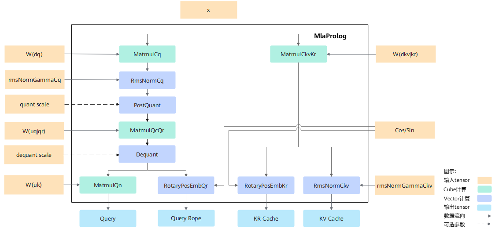
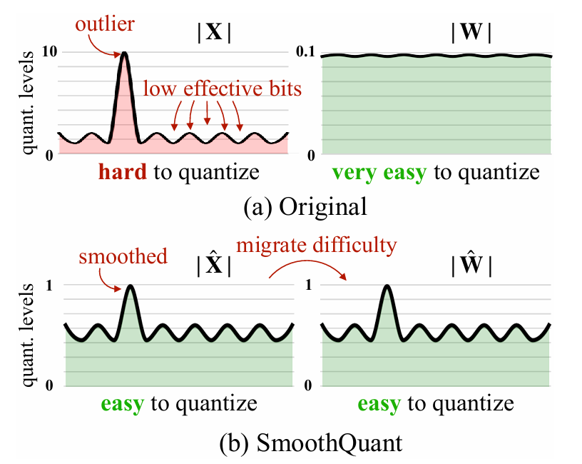
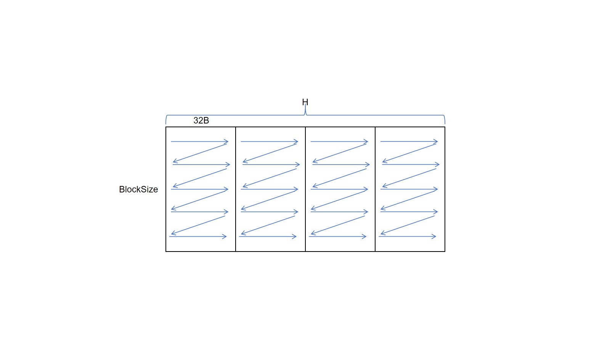

# MlaPrologV2算子设计介绍

近年来，随着人工智能技术的快速发展，大模型在自然语言处理、计算机视觉、多模态交互等领域取得了显著突破。然而，模型的复杂度和规模呈指数级增长，对底层计算框架和硬件算力提出了更高的要求。
传统的矩阵运算（如GEMM）和注意力机制实现方式在应对超大规模参数模型时，逐渐暴露出计算效率低、内存占用高、并行扩展性不足等问题，制约了模型训练和推理的实时性能及资源利用率。

在此背景下，DeepSeek团队提出Mla算子需求，需要对算法和硬件进行协同优化，通过算子融合，减少算子调用和头开销时间，在保证模型精度的前提下，降低推理延迟、并减少硬件资源消耗，MlaPrologV2算子正是Mla算子前处理融合部分。

## 实现原理

图1 计算流程图：




按照Multi-Head Latent Attention定义的计算流程实现，整体计算流程如下：

1. 输入序列x经过下采样$W^{DQ}$矩阵进行降秩变化，并进行归一化处理得到$c^Q$

2. 将$W^{UQ}$和$W^{QR}$矩阵进行拼接，实现对$c^Q$的升秩和映射计算，对运算结果再进行split拆分，分别做Qn的归一化处理和Rope位置编码，最终得到Query和Query Rope

3. 将$W^{DKV}$和$W^{KR}$矩阵进行拼接，对输入序列x实现降秩和映射计算，对运算结果再进行split拆分，分别做Rope位置编码和$C^{KV}$的归一化处理，最终得到KR Cache和KV Cache

4. 在输出Query量化的情况下，会对Query做Rowmax动态量化，最终得到量化后的Query和对应量化参数DequantScaleQNope

具体的计算公式，参见[完整计算公式](#完整计算公式)章节

## 数据切分设计

由于硬件buffer大小是有限的，而计算的数据量又是巨大的，无法一次计算完，那么就需要进行tiling切分，shape不同会导致算子的切分轴不同，而算子的切分轴，会影响模板的功能及性能。需要考虑如下几个点：

a. 将核心的数量用满，防止部分核闲置。

b. 每一个核心被分配的计算量相对均匀，避免出现某些核计算的数据量过大，其余核在围观的情况。

c. AIC和AIV之间处理的数据量要符合其对应的算力，避免AIC或AIV出现长时间的空闲。 

MlaPrologV2算子有多个Matmul运算：

1、MatmulCq：将BS合轴，做为M轴，HeadSizeCq为N轴，HeadSizeX为K轴，核间对HeadSizeCq按照cube核数进行切分，每个核分配一定的子块

2、MatmulCkvKr：将BS合轴，做为M轴，HeadSizeCkvKr为N轴，HeadSizeX为K轴，核间对HeadSizeCkvKr进行切分，分为64块

3、MatmulQcQr：将BS合轴，做为M轴，HeadSizeQcQr为N轴，HeadSizeCq为K轴，核间对HeadSizeQcQr按照cube核数进行切分，每个核分配一定的子块

4、MatmulQn：将BS合轴，做为M轴，HeadSizeCkv为N轴，dimHeadSizeQc为K轴

## 流水设计

MlaPrologV2融合算子包含了Vector计算和Cube计算，Vector侧和Cube侧的计算存在依赖关系，因此需要进行CV流水设计，
否则C侧和V侧很有可能是串行流水的效果，不能达到并行计算的目的，无法使得融合算子性能达到最优：

图2 流水控制图：


1、MatmulCq计算的时候，对Hcq进行了分核，单核没有计算一个完整的token，所以在RmsNormCq计算前，
需要做AIC与AIV之间的同步控制（SYNC_MMCQ_NOMRCQ)

2、MatmulCkvKr计算的时候，也是对Hcq进行了分核，单核没有计算一个完整的token，所以在RmsNormCkv计算前，也
需要做AIC与AIV之间的同步控制（SYNC_MMCKVKR_NOMRCKV)

3、由于RmsNormCq按照行切分到不同核上，因此在做MatmulQcQr计算的时候，也需要AIV与AIC的同步控制（SYNC_NOMRCQ_MMQCQR)

4、由于和RopeQr的分核策略不同，因此RopeQr计算前，也需要AIC和AIV之间的同步控制（SYNC_MMQCQR_ROPEQR)

5、由于MatmulQcQr和MatmulQn的分核策略不同，MatmulQn依赖与MatmulQcQrde shuchu ,因此需要做cube的全核同步（SYNC_ALL_CUBE)

6、Vector核运算前，需要做vector的全核同步（SYNC_ALL_VECTOR)，确保数据流水搬运

## TilingKey划分
TilingKey为uint64类型，每个模板参数对应TilingKey中的一到数个二进制位，具体实现如下：
|二进制位|变量名|说明|参数列表|
|-------|------|----|-------|
|0-3|CACHE_MODE|KVCache的存储格式|0-BNSD(预留)，1-PA_BSND，2-PA_NZ|
|4-5|SCENARIO|输入场景|0-FP16(预留)，1-非量化场景，2-量化场景|
|6-9|QUANT_MODE|量化场景|0-MMQcQr量化，1-MMQcQr量化+KVcache量化，2-MMcqCkvKr量化+MMQcQr量化，3-MMCqCkvkr量化+MMQcQr量化+KVcache量化|
|10|ENABLE_DEQUANT_OPTIONAL|反量化使能，不能与ENABLE_DEQUANT_OPTIONAL一同使用|0-关闭，1-开启|
|11|ENABLE_GROUP_COMPUTE_OPTIONAL|量化的算力分组优化，不能与ENABLE_DEQUANT_OPTIONAL一同使用|0-关闭，1-开启|
|12-13|EMPTY_TENSOR_MODE|空tensor场景，用于输入tensor维度为0的情况|0-无空tensor，1-KVCache为空和KRCache为空， 2-Query为空|

## 主流程

```c
// 单核计算伪码
void Process() {
    loops = compute_step_this_core(); //计算当前core的循环次数

    for (i = 0; i < loops; i++) {
        updateCurrentStepSize(i, stepSize, allTokenSize);  //刷新当前轮的计算的M轴大小
        if ASCEND_IS_AIC {
            MatmulCq(tokenXOffset, weightDqOffset, cqResOffset);
            CrossCoreSetFlag<0x2, PIPE_FIX>(SYNC_MMCQ_NORMSCQ_FLG);       //cube与vector同步

            MatmulCkvKr(tokenXOffset, weightDkvKrOffset, ckvKrResOffset);
            CrossCoreSetFlag<0x2, PIPE_FIX>(SYNC_MMCKVKR_NORMROPE_FLG);   //cube与vector同步

            CrossCoreWaitFlag(SYNC_MMCQ_NORMSCQ_FLG);                     // MatmulQcQr依赖RmsNormCq的输出，需要插入CV核间同步
      
            MatmulQcQr(weightUqQrOffset, qcQrResOffset);
            CrossCoreSetFlag<0x2, PIPE_FIX>(SYNC_MMQCQR_ROPEQR_FLG);      //cube与vector同步

            // 由于 MatmulQn 和 MatmulQcQr的分核策略不一样，MatmulQn又依赖MatmulQcQr的输出
            // 需要等所有cube核上的MatmulQcQr执行完后才能启动MatmulQn
            CrossCoreSetFlag<0x0, PIPE_FIX>(SYNC_ALL_CUBE_FLG);
            CrossCoreWaitFlag(SYNC_ALL_CUBE_FLG);
      
            MatmulQn(qcOffset, weightUkOffset, qnResOffset, mmQnLoopTime);  // MatmulQn的结果直接输出到 queryOut, qnOffset需要按Batch轴偏移
        }
    
        if ASCEND_IS_AIV {
            GetSinCos(tokenIndex);

            CrossCoreWaitFlag(SYNC_MMCQ_NORMSCQ_FLG);  // wait MatmulCq
            CrossCoreSetFlag<0x0, PIPE_MTE3>(SYNC_ALL_VECTOR_FLG);
            CrossCoreWaitFlag(SYNC_ALL_VECTOR_FLG);

            RmsNormCq(rmsNormCqOffset);

            // 由于RmsNormCq和MatmulQcQr的分核策略不一样，需要等所有vector上的RmsNormCq执行完成后才能启动 MatmulQcQr
            // 需要所有vector核上的RmsNormCq执行完成后，才发起MatmulQcQr的执行
            CrossCoreSetFlag<0x0, PIPE_MTE3>(SYNC_ALL_VECTOR_FLG);
            CrossCoreWaitFlag(SYNC_ALL_VECTOR_FLG);

            CrossCoreSetFlag<0x2, PIPE_MTE3>(SYNC_MMCQ_NORMSCQ_FLG);        // 保障MatmulQcQr等 RmsNormCq
            CrossCoreWaitFlag(SYNC_MMCKVKR_NORMROPE_FLG);                   // wait MatmulCkvKr
            CrossCoreSetFlag<0x0, PIPE_MTE3>(SYNC_ALL_VECTOR_FLG);
            CrossCoreWaitFlag(SYNC_ALL_VECTOR_FLG);

            RmsNormRopeScatterCkvKr(tokenIndex, rmsNormCkvOffset, ropeKrOffset);
            CrossCoreWaitFlag(SYNC_MMQCQR_ROPEQR_FLG);  // wait MatmulQcQr

            CrossCoreSetFlag<0x0, PIPE_MTE3>(SYNC_ALL_VECTOR_FLG);
            CrossCoreWaitFlag(SYNC_ALL_VECTOR_FLG);
            RopeQr(ropeQrOffset, ropeQrResOffset);
        }
    }
}
```


## 完整计算公式
结合前序章节的流程图，整个MlaPrologV2的完整计算公式如下：

$$
q^N = RmsNorm(x \cdot W^{DQ}) \cdot W^{UQ} \cdot W^{UK} \tag{a}
$$

$$
q^R = ROPE(RmsNorm(x \cdot W^{DQ}) \cdot W^{QR}) \tag{b}
$$

$$
k^R = ROPE(x \cdot W^{KR}) \tag{c}
$$

$$
c^{KV} = RmsNorm(x \cdot W^{DKV}) \tag{d}
$$

完整计算流程可以分解为以下的基本计算单元。

### MatmulCq
对输入$x$乘以Query下采样矩阵$W^{DQ}$进行下采样操作得到压缩后的Query矩阵$c^Q$。
$$
c^Q = x \cdot W^{DQ} \tag{1}
$$ 

本章节（以及后续章节）涉及的矩阵乘法模块使用AscendC Kernel API中Matmul高阶API实现。相关API使用可以参考官网[算子实现->矩阵编程（高阶API）](https://www.hiascend.com/document/detail/zh/CANNCommunityEdition/80RC3alpha003/devguide/opdevg/ascendcopdevg/atlas_ascendc_10_0041.html)开发指南。

### RMSNormCq
对压缩后的$Q$矩阵按行进行RMSNorm(均方根归一化)操作。RMSNorm操作需要传入两个超参$\gamma$和$\epsilon$，对应到接口文档中的$rmsnormGammaCq$和$rmsnormEpsilonCq$。
$$
c_{norm}^Q = RmsNorm(c^Q) \tag{2}
$$
RmsNorm的计算公式如下：
$$
RmsNorm(x) = \gamma \cdot \frac{x_i}{RMS(x)}  \tag{3}
$$
$$
RMS(x) = \sqrt{\frac{1}{N} \sum_{i=1}^{N} x_i^2 + \epsilon} \tag{4}  
$$

### MatmulCkvKr
对输入$x$乘以Key/Value下采样矩阵（Key/Value共享相同的下采样矩阵）得到压缩后的Key/Value矩阵$c^{KV}$。
$$
c^{KV} = x \cdot W^{DKV} \tag{5}
$$
对输入$x$乘以$W^{KR}$矩阵得到用于位置编码计算的$K^R$矩阵。
$$
k^R = x \cdot W^{KR} \tag{6}
$$
利用矩阵乘法的性质，$W^{DKV}$和$W^{KR}$矩阵可以横向拼接成一个矩阵$[W^{DKV}|W^{KR}]$来计算，该拼接矩阵对应接口文档的$weightDkvKr$参数。
$$
c^{KV}k^R = x \cdot [W^{DKV}|W^{KR}] = [x \cdot W^{DKV}|x \cdot W^{KR}] \tag{7}
$$

### RMSNormCkv
对压缩后的$KV$矩阵按行进行RMSNorm(均方根归一化)操作。RMSNorm操作需要传入两个超参$\gamma$和$\epsilon$，对应到接口文档中的$rmsnormGammaCkv$和$rmsnormEpsilonCkv$。
$$
c_{norm}^{KV} = RmsNorm(c^{KV}) \tag{8}
$$
RmsNorm的计算参考公式（3）-（4）。

### PostQuant/Dequant
- 基本概念
  - 量化：泛指用低位宽数据（通常是INT8）替代高位宽数据（通常是浮点数）完成存储、传输、计算等任务。有时特指把浮点数变成整数的计算过程。
  - 反量化：把低位宽数据恢复成高位宽数据。
- 量化基础公式是：
  $$
  x\_float≈round(x\_float/scale)∗scale
  $$
  其中PostQuant对应的是$round(x\_float/scale)$，将数据里的每个值都进行scale缩放，然后计算四舍五入。乘scale参数对应着反量化操作。

当前包含两种量化方式：

  - 动态量化：需要根据输入计算scale，并使用smooth_scale对输入进行平滑，对应公式为
    $$
    scale=max(abs(x\_float∗smooth\_scale))/127
    $$
    smooth是指将数据变得“平滑”一些，容易对数据进行量化，如下图所示：

    

  - 静态量化：当前仅支持Perchannel量化，该量化是指按列量化，对输入tensor的每一列用一个scale进行量化。

### MatmulQcQr
对归一化的$C^q$矩阵乘上Query上采样矩阵$W^{UQ}$得到$q^C$矩阵。
$$
q^C = c_{norm}^Q \cdot W^{UQ} \tag{9}
$$
对归一化的$C^q$矩阵乘以$W^{QR}$矩阵得到用于位置编码计算的$q^R$矩阵。
$$
q^R = c_{norm}^Q \cdot W^{QR} \tag{10}
$$
同样利用矩阵乘法的性质，$W^{UQ}$和$W^{QR}$矩阵可以横向拼接成一个矩阵$[W^{UQ}|W^{QR}]$来计算，该拼接矩阵对应接口文档的$weightDkvKr$参数。
$$
q^Cq^R = c_{norm}^Q \cdot [W^{UQ}|W^{QR}] = [c_{norm}^Q \cdot W^{UQ}|c_{norm}^Q \cdot W^{QR}] \tag{11}
$$

### RotaryPosEmb
旋转位置编码（Rotary Position Embedding, RoPE）是论文[Roformer](https://arxiv.org/abs/2104.09864)提出的一种位置编码算法，其原始计算公式如下：
$$
f_{\{q,k\}}(x_m, m) = R_{\Theta,m}^{d}W_{\{q,k\}}x_m \tag{12}
$$

$$
R_{\Theta,m}^{d} = 
\left(
\begin{matrix}
\cos m\theta_1 & -\sin m\theta_1 & 0 & 0 & \cdots & 0 & 0 \\
\sin m\theta_1 & \cos m\theta_1 & 0 & 0 & \cdots & 0 & 0 \\
0 & 0 & \cos m\theta_2 & -\sin m\theta_2 & \cdots & 0 & 0 \\
0 & 0 & \sin m\theta_2 & \cos m\theta_2 & \cdots & 0 & 0 \\
\vdots & \vdots & \vdots & \vdots & \ddots & \vdots & \vdots \\
0 & 0 & 0 & 0 & \cdots & \cos m\theta_{d/2} & -\sin m\theta_{d/2} \\
0 & 0 & 0 & 0 & \cdots & \sin m\theta_{d/2} & \cos m\theta_{d/2} \\
\end{matrix}
\right)
\tag{13}
$$
$$
\Theta = \{ \theta_i = 10000^{-2(i-1)/d}, i \in [1,2,...,d/2] \}
$$

其中，$f_{\{q,k\}}(x_m, m)$代表第$m$个token对应的词向量$x_m$集成了位置信息$m$之后的Query/Key向量，Query和Key向量计算公式一致。$d$为词向量的维度。

公式(12)展开变形后可以得到公式（14）的形式，其中$\otimes$为逐位对应相乘的叉乘。

$$
ROPE(x) = R_{\Theta,m}^{d} x = 
\left(
\begin{matrix}
x_0 \\
x_1 \\
x_2 \\
x_3 \\
\vdots \\
x_{d-2} \\
x_{d-1}
\end{matrix}
\right)
\otimes
\left(
\begin{matrix}
\cos m\theta_0 \\
\cos m\theta_0 \\
\cos m\theta_1 \\
\cos m\theta_1 \\
\vdots \\
\cos m\theta_{d/2-1} \\
\cos m\theta_{d/2-1}
\end{matrix}
\right)
+
\left(
\begin{matrix}
-x_1 \\
x_0 \\
-x_3 \\
x_2 \\
\vdots \\
-x_{d-1} \\
x_{d-2}
\end{matrix}
\right)
\otimes
\left(
\begin{matrix}
\sin m\theta_0 \\
\sin m\theta_0 \\
\sin m\theta_1 \\
\sin m\theta_1 \\
\vdots \\
\sin m\theta_{d/2-1} \\
\sin m\theta_{d/2-1} \\
\end{matrix}
\right)
\tag{14}
$$

为了节省$cos$/$sin$的存储空间并简化内部的实现逻辑，考虑$q^R*k^R$矩阵乘最终要进行Reduce操作：同时调整行和列中元素的位置，不影响最后的累加结果。最终内部$ROPE$实现的计算调整成公式（15）的形式，对输入$x$按奇偶位置拆分成两部分，对应的$cos$和$sin$部分的输入是连续的。

$$
ROPE(x) = R_{\Theta,m}^{d} x = 
\left(
\begin{matrix}
x_0 \\
x_2 \\
\vdots \\
x_{d-2} \\
x_{1} \\
x_{3} \\
\vdots \\
x_{d-1}
\end{matrix}
\right)
\otimes
\left(
\begin{matrix}
\cos m\theta_0 \\
\cos m\theta_1 \\
\vdots \\
\cos m\theta_{d/2-1} \\
\cos m\theta_0 \\
\cos m\theta_1 \\
\vdots \\
\cos m\theta_{d/2-1} \\
\end{matrix}
\right)
+
\left(
\begin{matrix}
-x_1 \\
-x_3 \\
\vdots \\
-x_{d-1} \\
x_0 \\
x_2 \\
\vdots \\
x_{d-2}
\end{matrix}
\right)
\otimes
\left(
\begin{matrix}
\sin m\theta_0 \\
\sin m\theta_1 \\
\vdots \\
\sin m\theta_{d/2-1} \\
\sin m\theta_0 \\
\sin m\theta_1 \\
\vdots \\
\sin m\theta_{d/2-1} \\
\end{matrix}
\right)
\tag{15}
$$

在整个MlaPrologV2算子中，需要对$q^R$矩阵和$k^R$矩阵执行$ROPE$计算得到最终的$queryRope$和$keyRope$信息，$keyRope$信息最终要更新到$KRCache$中。
$$
q^R = ROPE(q^R)
$$
$$
k^R = ROPE(k^R)
$$
### MatmulQn
对$q^C$矩阵乘上Key的上采样矩阵$W^{UK}$得到最终的Query矩阵$q^N$。
$$
q^N = q^C \cdot W^{UK} \tag{16}
$$

### KVCache
在计算得到输入$x$对应的Key/Value结果后，将Key/Value的结果更新到KVCache的对应位置。当前引入cacheIndex来标识计算结果在KVCache中的存储位置。cacheIndex是一个2维的Tensor，shape为[B, S]，标识Query中每个Token的目标更新位置。当前KVCache主要支持非PA（Page Attention）场景、PA场景（ND格式存储和NZ格式存储）。

PA场景
- KVCache使用ND格式存储，其更新流程如图3所示。
  - 假设Query中Token/序列长度为S1，cacheIndex中第二维的某个具体数值代表了本轮计算得到的KVCache要更新到KVCache的第几行；如图中的11代表要更新到第11行的位置，该位置位于Block2。
  - 图3 KVCacheScatter操作（PA场景-ND格式）
  
- KVCache使用NZ格式存储，其更新流程如图4所示。数据分形格式的介绍可以参考官网指南-[数据排布格式
](https://www.hiascend.com/document/detail/zh/CANNCommunityEdition/80RC3alpha003/devguide/opdevg/ascendcopdevg/atlas_ascendc_10_0104.html)。
  - 当前按NZ格式存储KVCache时，是将整个Block存储成NZ格式；小块内是以行为主(Row Major)的排布，形状如Z字型；块与块之间是以列为主的排布，形状如N字形。将完整的H(Hidden States)按32B长度的小块进行分块后，在ND格式下连续存储的小块，在NZ格式下需要需要跳$32B * BlockSize$存储，即需要设置stride为$32B * BlockSize$。
  - 图4 KVCacheScatter操作（PA场景-NZ格式）
  


### KRCache
在计算得到输入$x$对应的KeyRope结果后，将KeyRope结果更新到KRCache的对应位置。当前引入cacheIndex来标识计算结果在KRCache中的存储位置。

KRCache的更新逻辑同KVCache。


