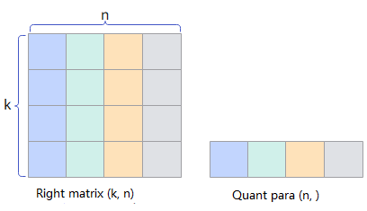
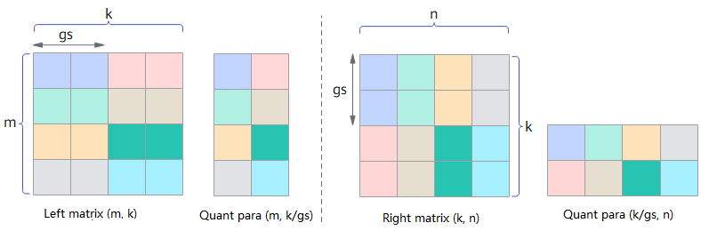

# Quantization Introduction

Quantization is widely used in deep learning models, particularly during inference. Through quantization, models can run more efficiently on hardware, reducing computational resource consumption and accelerating the inference process, while also lowering model storage requirements.

CANN operator quantization refers to the computation process of converting input Tensors of Matmul and other matrix (cube) type operators in neural networks from high bit to low bit, while generating corresponding quantization parameters scale. When low-bit cube computation is completed, the quantization parameters scale can convert low-bit values back to high-bit values, ensuring overall computation result correctness (the effect is approximately equivalent to direct high-bit computation), and effectively improving computation efficiency.

- Static quantization: Uses pre-determined quantization parameters for quantization. In inference scenarios, quantization of weight generally uses static quantization, and quantized operator performance is better.
- Dynamic quantization: Uses input data to compute quantization parameters online for quantization. In inference scenarios, quantization of activation generally uses dynamic quantization, which better adapts to data changes and has higher precision; in training scenarios, dynamic quantization is also generally used to improve quantization precision. Note that dynamic quantization generates quantization parameters online, so quantized operator performance is slightly worse.

## Quantization Mode

Quantization mode (also called quantization granularity) refers to different quantization computation levels applied to different input Tensors of an operator. Common quantization computation modes include:

> Note:
>
>- The m, n, k variables represent the sizes of different axes in Tensor computation.
>- Left matrix and right matrix refer to the two input Tensors used for matrix multiplication computation in cube operators. Generally, the left matrix represents activation and the right matrix represents weight. Users should understand and use them according to actual situations.

- pertensor quantization (abbreviated as T quantization): The quantization object can be either the left matrix or the right matrix, and each Tensor shares the same quantization parameter.

  Assuming the left matrix shape is (m, k) and the right matrix shape is (k, n), k is the reduce axis, and the generated quantization parameter shape is (1, ).

  
  
- perchannel quantization (abbreviated as C quantization): The quantization object is the right matrix, and each channel uses an independent quantization parameter.

  Assuming the right matrix shape is (k, n), k is the reduce axis, and the generated quantization parameter shape is (n, ).

  
- pertoken quantization (abbreviated as K quantization): The quantization object is the left matrix, and each token uses an independent quantization parameter.

  Assuming the left matrix shape is (m, k), k is the reduce axis, and the generated quantization parameter shape is (m, ).

  

- pergroup quantization (abbreviated as G quantization): The quantization object can be either the left matrix or the right matrix. Data is grouped on the reduce axis, and each group uses an independent quantization parameter.
  - Assuming the left matrix shape is (m, k), k is the reduce axis, grouped on the k axis with group size gs, the generated quantization parameter shape is (m, k/gs).
  - Assuming the right matrix shape is (k, n), k is the reduce axis, grouped on the k axis with group size gs, the generated quantization parameter shape is (k/gs, n).

  

- perblock quantization (abbreviated as B quantization): The quantization object can be either the left matrix or the right matrix. Data is blocked on all axes, and each block uses an independent quantization parameter.

  - Assuming the left matrix shape is (m, k), k is the reduce axis, data is grouped on the m and k axes respectively with (bs, bs) blocks, bs is the block size, and the generated quantization parameter shape is (m/bs, k/bs).
  - Assuming the right matrix shape is (k, n), k is the reduce axis, data is grouped on the k and n axes respectively with (bs, bs) blocks, bs is the block size, and the generated quantization parameter shape is (k/bs, n/bs).

  

## Common Combined Quantization

- Full quantization: Generally refers to the mode where both the left and right matrices are quantized, including:
  - pertensor-perchannel quantization mode (abbreviated as T-C quantization mode)
  - pertoken-perchannel quantization mode (abbreviated as K-C quantization mode)
  - pergroup-perblock quantization mode (abbreviated as G-B quantization mode)
  - pertensor-perchannel-pergroup quantization mode (abbreviated as T-CG quantization mode)
  - perblock-perblock quantization mode (abbreviated as B-B quantization mode)
- Pseudo quantization: Generally refers to the mode where only the weight matrix is quantized, including perchannel quantization mode (abbreviated as C quantization mode).
- Mx quantization: Essentially Microscaling quantization, which maintains model precision at extremely low bits (such as 1bit) by dynamically adjusting scaling factors. This refers to the pergroup-pergroup quantization mode (abbreviated as G-G quantization mode), which is a special case where the quantization parameter type is FLOAT8_E8M0 and the group size is 32.
