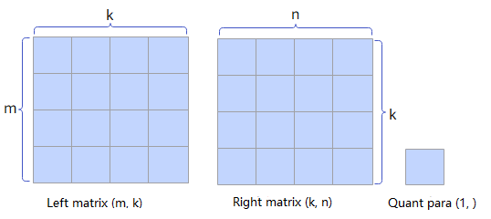
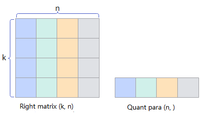
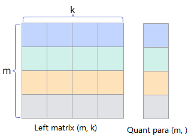
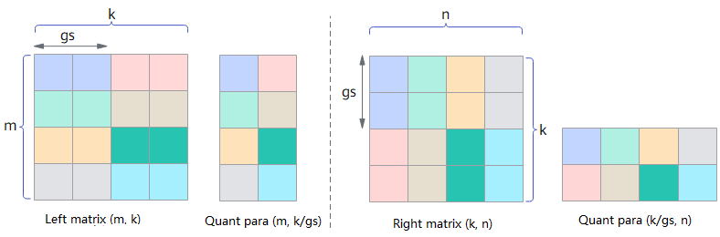
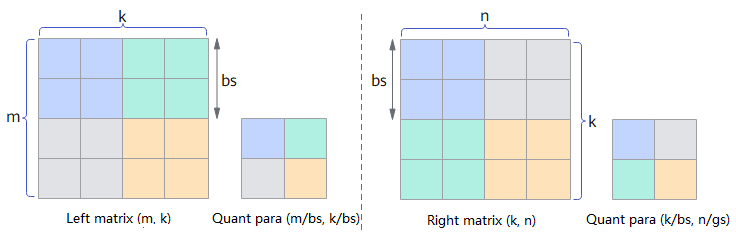

# Quantization Introduction

Quantization is widely used in deep learning models, especially in the inference process. Quantization enables models to run more efficiently on hardware. It can reduce the consumption of compute resources, accelerate the inference process, and lower the storage requirements of models.

CANN operator quantization refers to the process of converting the input tensors of matrix (cube) operators such as Matmul in a neural network from high bits to low bits, and generating the corresponding quantization parameter **scale**. After the low-bit cube computation is complete, the low-bit value can be converted back to the high-bit value by using the quantization parameter **scale**. This ensures the correctness of the overall computation result (the effect is approximately equivalent to that of direct high-bit-based computation) and effectively improves the computation efficiency.

- Static quantization uses predetermined quantization parameters for quantization. In inference scenarios, static quantization is usually used for weight quantization, as it yields superior performance for quantizing operators.
- Dynamic quantization uses input data to calculate quantization parameters online for quantization. In inference scenarios, dynamic quantization is usually used for activation quantization, as it is more adaptable to data changes and yields higher accuracy. In training scenarios, dynamic quantization is also used to improve quantization accuracy. Note that the performance of dynamic quantization operators is slightly poor because quantization parameters need to be generated online.

## Quantization Mode

The quantization mode (also called quantization granularity) indicates the quantization levels of different input tensors of an operator. The common quantization modes are as follows:

>Note:
>
>- The variables *m*, *n*, and *k* indicate the sizes of different axes of a tensor.
>- The left matrix and right matrix refer to the two input tensors used for matrix multiplication computation in the cube operator. Generally, the left matrix represents activation, and the right matrix represents weight. You can understand and use them as required.

- pertensor quantization (T quantization for short): The quantization object can be either the left matrix or the right matrix. Each tensor shares one quantization parameter.

  Assume that the shape of the left matrix is (m, k), the shape of the right matrix is (k, n), k is the reduce axis, and the shape of the generated quantization parameter is (1, ).

  

- perchannel quantization (C quantization for short): The quantization object is the right matrix. Each channel uses separate quantization parameters.

  Assume that the shape of the right matrix is (k, n), k is the reduce axis, and the shape of the generated quantization parameter is (n, ).

  

- pertoken quantization (K quantization for short): The quantization object is the left matrix. Each token uses separate quantization parameters.

  Assume that the shape of the left matrix is (m, k), k is the reduce axis, and the shape of the generated quantization parameter is (m, ).

  

- pergroup quantization (G quantization for short): The quantization object can be the left matrix or the right matrix. Data is grouped along the reduce axis, and each group uses separate quantization parameters.
  - Assume that the shape of the left matrix is (m, k), k is the reduce axis on which grouping is performed, the group size is gs, and the shape of the generated quantization parameter is (m, k/gs).
  - Assume that the shape of the right matrix is (k, n), k is the reduce axis on which grouping is performed, the group size is gs, and the shape of the generated quantization parameter is (k/gs, n).

  

- perblock quantization (B quantization for short): The quantization object can be the left matrix or the right matrix. Data is divided into blocks along all axes, and each block uses separate quantization parameters.

  - Assume that the shape of the left matrix is (m, k), k is the reduce axis, data is grouped by (bs, bs) block on the m and k axes, and bs is the block size. The shape of the generated quantization parameter is (m/bs, k/bs).
  - Assume that the shape of the right matrix is (k, n), k is the reduce axis, data is grouped by (bs, bs) block on the k and n axes, and bs is the block size. The shape of the generated quantization parameter is (k/bs, n/bs).

  

## Common Combined Quantization

- Full quantization: Generally, both the left matrix and right matrix are quantized. The combinations include:
  - pertensor-perchannel quantization mode (T-C quantization mode for short)
  - pertoken-perchannel quantization mode (K-C quantization mode for short)
  - pergroup-perblock quantization mode (G-B quantization mode for short)
  - pertensor-perchannel-pergroup quantization mode (T-CG quantization mode for short)
  - perblock-perblock quantization mode (B-B quantization mode for short)
- Fake quantization: Generally, the weight matrix (weight) is quantized. This type includes the perchannel quantization mode (C quantization mode for short).
- mx quantization: It is essentially microscaling quantization, which dynamically adjusts the scale factor to maintain the model accuracy at an extremely low bit width (for example, 1 bit). Here, it refers to the pergroup-pergroup quantization (G-G quantization) mode, which is a special case where the quantization parameter type is FLOAT8_E8M0 and the group size is 32.
