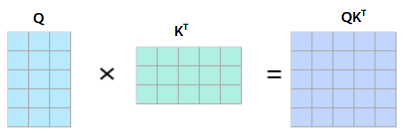
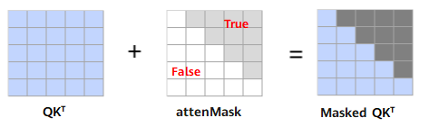
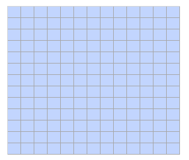
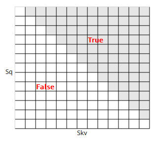
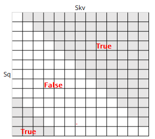
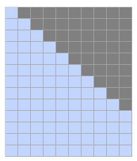
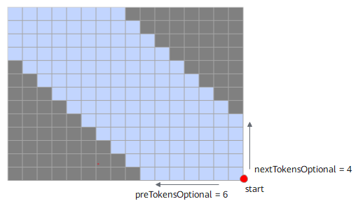
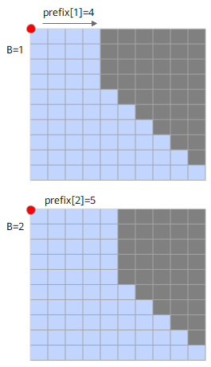
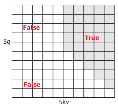
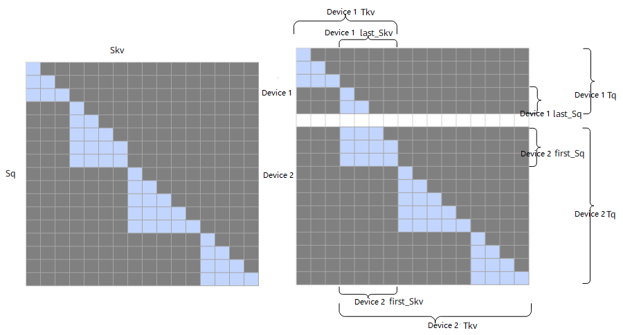

# sparseMode Introduction

In the large model domain, sparseMode (sparse mode) typically refers to the sparsity design of parameters or activations in the model architecture or computation formula, as opposed to DenseMode.

This section introduces commonly used sparseMode and corresponding scenario descriptions.

| sparseMode | Meaning | Note |
| ---------- | --------------------- | ------------------ |
| 0          | defaultMask mode. | - |
| 1          | allMask mode. | - |
| 2          | leftUpCausal mode. | - |
| 3          | rightDownCausal mode. | - |
| 4          | band mode. | - |
| 5          | prefix uncompressed mode. | Not supported in varlen scenarios. |
| 6          | prefix compressed mode. | - |
| 7          | varlen outer-split scenario, rightDownCausal mode. | Only supported in varlen scenarios. |
| 8          | varlen outer-split scenario, leftUpCausal mode. | Only supported in varlen scenarios. |

The working principle of attenMask is to mask the value of the query (Q) and key (K) transposed matrix product at positions where Mask is True, as illustrated below:

The $QK^T$ matrix is masked at positions where attenMask is True, with the effect as follows:

## sparseMode=0

When sparseMode is 0, it represents the defaultMask mode.

- No mask passed: If attenMask is not passed, no mask operation is performed. attenMask value is None, and preTokens and nextTokens values are ignored. The Masked $QK^T$ matrix is illustrated as follows:

  

- nextTokens value is 0, preTokens is greater than or equal to Sq, representing causal scenario sparse. attenMask should pass a lower triangular matrix. The part between preTokens and nextTokens needs to be computed. The Masked $QK^T$ matrix is illustrated as follows:

   

  attenMask should pass a lower triangular matrix, illustrated as follows:
  
  

- preTokens is less than Sq, nextTokens is less than Skv, and both are greater than or equal to 0, representing band scenario. The part between preTokens and nextTokens needs to be computed. The Masked $QK^T$ matrix is illustrated as follows:

       
  
  attenMask should pass a band-shaped matrix, illustrated as follows:

  

- nextTokens is negative. Using preTokens=9, nextTokens=-3 as an example, the part between preTokens and nextTokens needs to be computed. The Masked $QK^T$ is illustrated as follows:

  **Note: When nextTokens is negative, the preTokens value must be greater than or equal to the absolute value of nextTokens, and the absolute value of nextTokens must be less than Skv.**
  
   

- preTokens is negative. Using nextTokens=7, preTokens=-3 as an example, the part between preTokens and nextTokens needs to be computed. The Masked $QK^T$ is illustrated as follows:

  **Note: When preTokens is negative, the nextTokens value must be greater than or equal to the absolute value of preTokens, and the absolute value of preTokens must be less than Sq.**

   
  
## sparseMode=1

When sparseMode is 1, it represents allMask, meaning a complete attenMask matrix is passed.

In this scenario, nextTokens and preTokens values are ignored. The Masked $QK^T$ matrix is illustrated as follows:

<!--   -->

## sparseMode=2

When sparseMode is 2, it represents the leftUpCausal mode mask, corresponding to the lower triangular scenario divided by the upper-left vertex (parameter starting point is the upper-left corner).

In this scenario, preTokens and nextTokens values are ignored. The Masked $QK^T$ matrix is illustrated as follows:

<!--  -->

The passed attenMask is an optimized compressed lower triangular matrix (2048\*2048). The compressed lower triangular matrix is illustrated (same below):

<!--   -->

## sparseMode=3

When sparseMode is 3, it represents the rightDownCausal mode mask, corresponding to the lower triangular scenario divided by the lower-right vertex (parameter starting point is the lower-right corner).

In this scenario, preTokens and nextTokens values are ignored. attenMask is an optimized compressed lower triangular matrix (2048\*2048). The Masked $QK^T$ matrix is illustrated as follows:

<!--  -->

## sparseMode=4

When sparseMode is 4, it represents the band scenario, computing the part between preTokens and nextTokens. The parameter starting point is the lower-right corner, and preTokens and nextTokens must have an intersection. attenMask is an optimized compressed lower triangular matrix (2048\*2048). The Masked $QK^T$ matrix is illustrated as follows:

<!--  -->

## sparseMode=5

When sparseMode is 5, it represents the prefix uncompressed scenario, which adds a matrix with length Sq and width N on the left side based on rightDownCausal. The N value is obtained from the optional input prefix. For example, the figure below shows batch=2 scenario with prefix passing array [4,5], where the N value for each batch axis can be different. The parameter starting point is the upper-left corner.

In this scenario, preTokens and nextTokens values are ignored. The attenMask matrix data format must be BNSS or B1SS. The Masked $QK^T$ matrix is illustrated as follows:

<!--  -->

attenMask should pass a matrix illustrated as follows:

<!--  -->

## sparseMode=6

When sparseMode is 6, it represents the prefix compressed scenario. In the prefix scenario, attenMask is an optimized compressed lower triangular + rectangular matrix (3072\*2048): the upper half is a [2048, 2048] lower triangular matrix, and the lower half is a [1024, 2048] rectangular matrix where the left half is all 0 and the right half is all 1. The attenMask matrix to be passed is illustrated as follows. In this scenario, preTokens and nextTokens values are ignored.

<!--  -->

## sparseMode=7

When sparseMode is 7, it represents varlen and long sequence outer-split scenario (long sequences are split across multiple cards for query sequence length in the model script). Users must ensure that before outer-split, the scenario uses sparseMode 3. In this mode, users need to set preTokens and nextTokens (starting point is the lower-right vertex), and must ensure correct parameters, otherwise precision issues will occur.

The Masked $QK^T$ matrix is illustrated as follows. In the second batch, query is split, key and value are not split. The 4x6 mask matrix is split into 2x6 and 2x6 masks, computed on card 1 and card 2 respectively:

- The last block mask on card 1 is a band-type mask. Configure preTokens=6 (ensure greater than or equal to the last Skv), nextTokens=-2. actual_seq_qlen should pass {3,5}, actual_seq_kvlen should pass {3,9}.
- The mask type on card 2 remains unchanged after splitting. sparseMode is 3. actual_seq_qlen should pass {2,7,11}, actual_seq_kvlen should pass {6,11,15}.

<!--  -->

**Note**:

- For sparseMode=7, band represents the sparse type of the last non-empty tensor's Batch. If there is only one batch, users need to configure parameters according to band mode requirements. When sparseMode=7, users need to input a 2048x2048 lower triangular mask as input for this fusion operator.
- The band mode sparse parameters generated from outer-split based on sparseMode=3 must satisfy the following conditions:
  - preTokens >= last_Skv.
  - last_Sq-last_Skv <= nextTokens <= 0.
  - The optional input pse is not supported in this mode.
- Non-band mode batches must satisfy: Sq <= Skv.

## sparseMode=8

When sparseMode is 8, it represents varlen and long sequence outer-split scenario. Users must ensure that before outer-split, the scenario uses sparseMode 2. In this mode, users need to set preTokens and nextTokens (starting point is the lower-right vertex), and must ensure correct parameters, otherwise precision issues will occur.

The Masked $QK^T$ matrix is illustrated as follows. In the second batch, query is split, key and value are not split. The 5x4 mask matrix is split into 2x4 and 3x4 masks, computed on card 1 and card 2 respectively:

- The mask type on card 1 remains unchanged after splitting. sparseMode is 2. actual_seq_qlen should pass {3,5}, actual_seq_kvlen should pass {3,7}.
- The first block mask on card 2 is a band-type mask. Configure preTokens=4 (ensure greater than or equal to the first Skv), nextTokens=1. actual_seq_qlen should pass {3,8,12}, actual_seq_kvlen should pass {4,9,13}.

<!--  -->

**Note**:

- For sparseMode=8, band represents the sparse type of the first non-empty tensor's Batch. If there is only one batch, users need to configure parameters according to band mode requirements. When sparseMode=8, users need to input a 2048x2048 lower triangular mask as input for this fusion operator.
- The band mode sparse parameters generated from outer-split based on sparseMode=2 must satisfy the following conditions:
  - preTokens >= first_Skv.
  - nextTokens >= first_Sq - first_Skv, configure according to actual situations.
  - The optional input pse is not supported in this mode.
